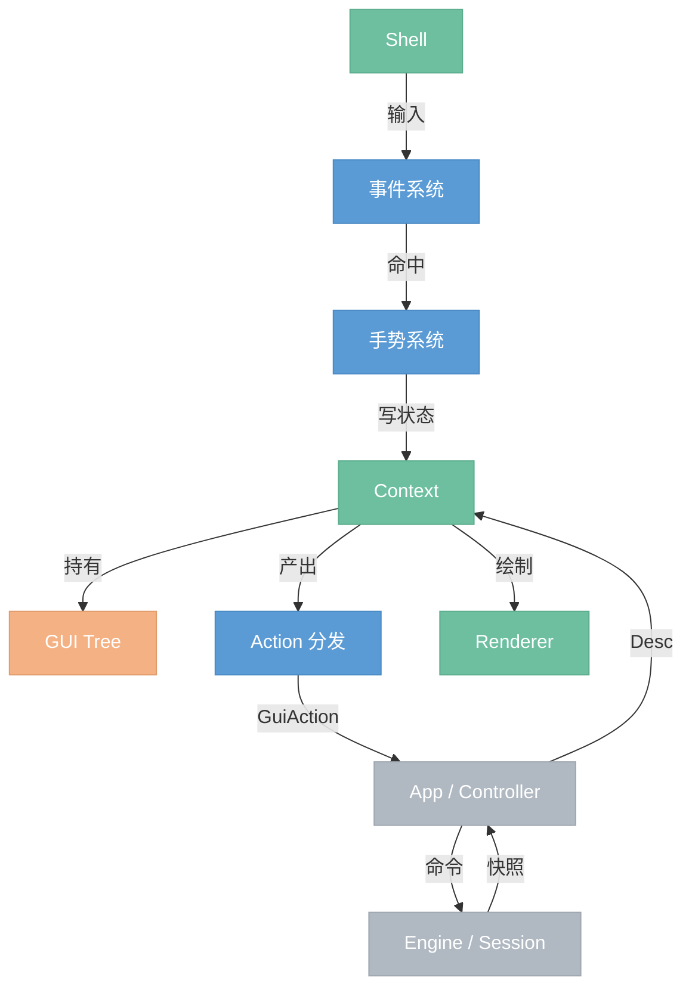

# GUI

> 图形界面前端。自建渲染 + 保留模式。targetv2 的 GUI 以一棵 GUI Tree 作为窗口内唯一 UI 结构与状态载体；Engine Graph 只保存作品语义，GUI Tree 只通过稳定 id 引用 engine 对象。

## 模块总览



## 职责边界

属于 GUI：

- 维护一个窗口 / `Context` 内的 GUI Tree。
- 处理输入事件、命中测试、手势识别、焦点、capture、modal、tab order。
- 维护 canvas、panel、overlay、widget 的 UI runtime 状态。
- 根据 App 提供的 `Desc` reconcile、layout、paint。
- 输出 `GuiAction` 和 `PlatformEffect`。
- 导出 / 导入项目 UI 布局状态。

不属于 GUI：

- 不保存 Engine Graph 语义状态。
- 不直接执行 `add_node`、`connect`、`set_param`、`execute`。
- 不拥有 GPU texture、OS 文件弹窗、剪贴板、IME 会话、异步任务句柄。
- 不把图片 demo 的业务流程写进通用 widget。

## 数据流

```text
用户操作
  -> Shell 翻译平台事件
  -> Event 做 hit test 和 target resolve
  -> Gesture 识别 tap / double click / drag / resize
  -> Context 写 GUI Tree runtime
  -> Action 分发产出 GuiAction
  -> App / Controller 调 Engine / Session
  -> App 查询 Engine snapshot 并构建 Desc
  -> Context reconcile / layout / paint
  -> Renderer 绘制
```

## 核心模块

| 模块 | 职责 |
| --- | --- |
| `Context` | GUI 对外门面，协调 update / event / render。 |
| `Tree` | GUI 结构、rect、children、runtime slots 的唯一载体。 |
| `Desc` | App 每帧声明“这一帧 GUI 应该长什么样”。 |
| `Action` | 把点击、手势和 `ActionId` 转成对 App 的 `GuiAction`。 |
| `Event` | 平台输入到 GUI 输入、命中目标、路由顺序。 |
| `Gesture` | tap、double click、drag、resize、long press 等识别。 |
| `Interaction` | root interaction runtime 的 reducer 与查询。 |
| `Widget` | 通用控件 props、anatomy、painters。 |
| `Canvas` | 节点画布、camera、node card、port、connection。 |
| `Panel` | 面板声明、布局 runtime、拖拽、resize、z-order。 |
| `Overlay` | node palette、context menu、tooltip、modal。 |
| `Resource` | GUI 资源 id、状态、texture resolver。 |
| `Persistence` | `ProjectLayout` import / export。 |
| `Accessibility` | 从 GUI Tree 派生 accessibility tree。 |
| `Renderer` | DrawCommand / GPU pipeline。 |
| `Shell` | 窗口、surface、平台事件、cursor、IME。 |

## 对外接口

GUI 对 App 提供：

```rust
impl GuiContext {
    pub fn update(&mut self, desc: Desc, input: GuiFrameInput) -> GuiUpdateResult;
    pub fn handle_event(&mut self, event: GuiInputEvent) -> GuiOutput;
    pub fn render(&self, renderer: &mut Renderer, theme: &Theme);
    pub fn hit_test(&self, pos: Point) -> HitChain;
    pub fn export_project_layout(&self) -> ProjectLayout;
    pub fn import_project_layout(&mut self, layout: ProjectLayout);
}
```

GUI 对 App 输出：

```rust
pub struct GuiOutput {
    pub actions: Vec<GuiAction>,
    pub platform_effects: Vec<PlatformEffect>,
    pub layout_changes: Vec<ProjectLayoutChange>,
    pub needs_repaint: bool,
}
```

## 依赖接口

GUI 依赖外部模块提供的最小接口：

| 接口 | 提供方 | 用途 |
| --- | --- | --- |
| `EngineRead` | App / Session adapter | 构建 canvas、node palette、preview 等 `Desc`。 |
| `EngineCommand` | App / Controller | 消费 `GuiAction` 后调用 engine。 |
| `NodeCatalogProvider` | Engine node manager adapter | 节点库分类和搜索。 |
| `ResourceResolver` | GUI resource / renderer / artifact adapter | image/artifact id 到 texture/status。 |
| `PlatformAdapter` | Shell | cursor、IME、clipboard、file dialog、redraw。 |
| `TextMeasure` | Renderer | layout 文本测量。 |
| `ThemeProvider` | App / GUI theme | widget build 和 paint。 |
| `FrameClock` | Shell frame loop | animation runtime 更新。 |

规则：GUI Tree 不直接持有这些接口。App / Context adapter 把外部事实转成 `Desc`、`NodeProps`、resource id、`GuiAction` 或 `PlatformEffect`。

## 文件结构设计

完整 GUI 文件结构见 [`2.3.0-gui-modules.draft.md`](2.3.0-gui-modules.draft.md)。GUI Tree 状态模型见 [`2.2.0-gui-tree.draft.md`](2.2.0-gui-tree.draft.md)。旧 RuntimeSystems 过渡边界见 [`2.1.0-gui-runtime.draft.md`](2.1.0-gui-runtime.draft.md)。

首版重点不是一次性搬完所有文件，而是先锁定三个结构性边界：

- `Tree` 是 UI 状态唯一载体。
- `Action` 是 GUI 到 App 的语义出口。
- `Overlay` 统一承载 node palette、context menu、tooltip、modal。
