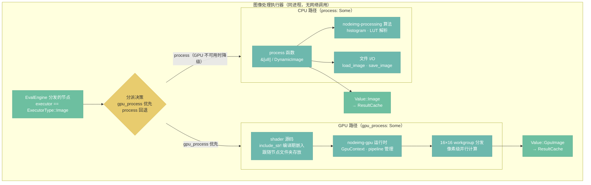

# 图像处理执行器

> 定位：本地 GPU + CPU 协作的图像处理执行路径——像素运算走 GPU shader，文件 I/O 和分析走 CPU。

## 架构总览

## GPU 路径

**GPU 路径（`gpu_process: Some`）— 像素级运算**

执行器从节点定义中取出 shader 源码（通过 `include_str!` 在编译期嵌入，跟随节点文件夹存放），提交给 `nodeimg-gpu` 运行时，按 `16×16` workgroup size 分发计算。所有像素级运算（亮度、对比度、模糊、混合等）走此路径。

## CPU 路径

**CPU 路径（`process: Some`）— 文件 I/O 与数据分析**

节点函数直接以 `&[u8]`（或 `image::DynamicImage`）为输入输出，调用 `nodeimg-processing` 中的算法。适用于 GPU 无法完成的操作：文件 I/O（`load_image`、`save_image`）、直方图计算、LUT 文件解析。

## 分派规则

大多数节点只提供一条路径——像素运算只写 `gpu_process`，I/O 和分析只写 `process`。少数节点（如 `gaussian_blur`）同时提供两条路径，此时 GPU 优先，CPU 仅在 GPU 上下文不可用时（无兼容 GPU 或驱动问题）作为降级选项。

## 设计决策

- **D29**：GPU 优先，CPU 仅在 GPU 不可用时降级
