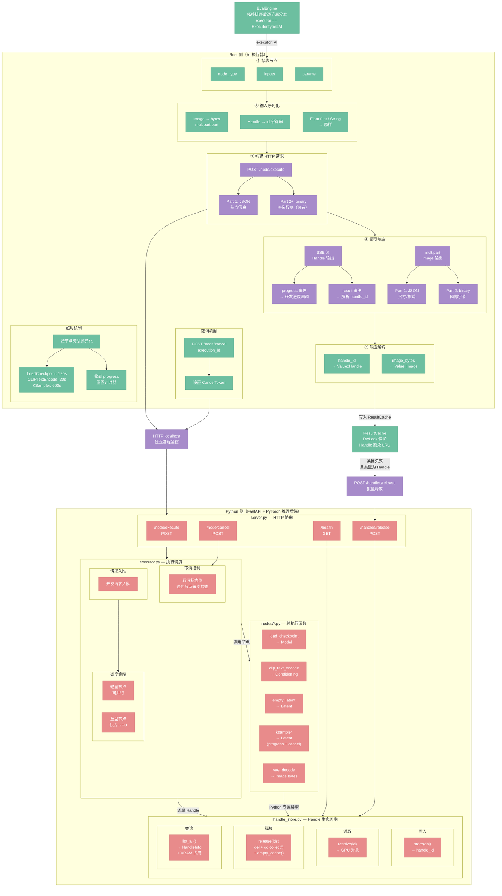

# AI 执行器

> 定位：Rust 与 Python 推理后端之间的协议桥——HTTP + SSE 通信、Handle 透传、取消与超时。

## 架构总览

---

## Rust 侧工作流

AI 执行器是 Rust 与 Python 后端之间的协议桥。两侧职责明确分离：

**Rust 侧（AI 执行器）五阶段：**

1. **接收节点**：从 `EvalEngine` 获取 `node_type`、`inputs`、`params`
2. **输入序列化**：`Image` 转 bytes（multipart），`Handle` 转 id 字符串，基础类型原样传递
3. **构建 HTTP 请求**：`POST /node/execute`，multipart/form-data 格式
4. **读取响应**：SSE 流（Handle 输出）或 multipart（Image 输出），转发 progress 事件给 UI
5. **响应解析**：`handle_id` → `Value::Handle`，`image_bytes` → `Value::Image`

**Python 侧（FastAPI + PyTorch）四模块：**

- **server.py**：HTTP 路由层（`/node/execute`、`/handles/release`、`/node/cancel`、`/health`）
- **executor.py**：执行调度（并发入队、轻量节点可并行/重型节点独占 GPU、取消标志位）
- **handle_store.py**：Handle 生命周期（store / resolve / release / list_all）
- **nodes/*.py**：纯执行函数（load_checkpoint、ksampler 等）

## Handle 存储

Python 后端维护一张 `handle_id → GPU 对象` 的映射表。当节点返回的是 PyTorch Tensor、模型权重或 CLIP embedding 等 Python 专属类型时，后端将其存入映射表并返回一个不透明的 `handle_id`。Rust 侧将其包装为 `Value::Handle`，在后续节点中作为输入透传，无需跨进程传输大体积数据。

当 `EvalEngine` 的缓存失效时，它会调用 `/handles/release`，按 `handle_id` 列表批量释放 Python 侧的 GPU 内存，避免 VRAM 泄漏。

Handle 协议的完整定义（ID 格式、release 接口规范）见 [50-python-protocol.md](./50-python-protocol.md)。

## 进度反馈

`POST /node/execute` 返回 SSE 流：

- 非迭代节点直接推送一条 `result` 事件后关闭流。
- 迭代节点（如 `KSampler`）每步推送一条 `progress` 事件（字段：`step`、`total`），最后推送 `result` 事件。Rust 侧将 `progress` 事件转发给 UI 层的进度回调，实现实时进度展示。

SSE 事件流的完整格式规范见 [50-python-protocol.md](./50-python-protocol.md)。

## 设计决策

- **D25**：AI 节点通过 HTTP + SSE 与 Python 推理后端通信
