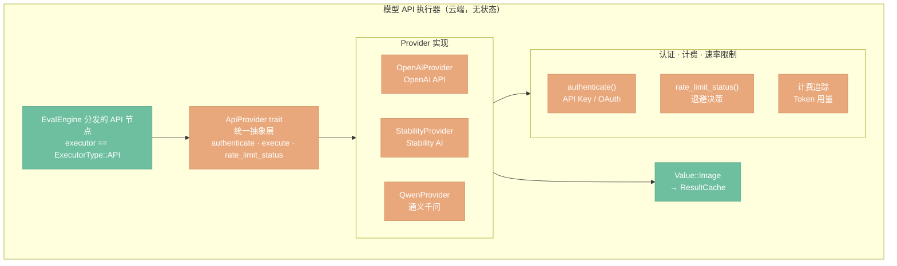

# 模型 API 执行器

> 定位：云端大厂推理 API（OpenAI、Stability AI、通义千问）的执行路径——无状态调用、认证、限流。

## 架构总览



## 与 AI 执行器的对比

| | AI 执行器 | 模型 API 执行器 |
|---|----------|----------------|
| 目标 | 自部署 Python 推理后端 | 云端大厂 API（OpenAI、Stability、通义） |
| 调用模式 | 逐节点调用，Handle 共享模型 | 一次调用完成整个生成 |
| 节点粒度 | 模块化拆分（LoadCheckpoint / KSampler / VAEDecode 分离） | 单节点封装整个 API 调用 |
| 中间状态 | Handle 在 Python VRAM，跨节点复用 | 无中间状态，无状态调用 |
| 额外关注 | SSE 进度、Handle 生命周期管理 | 认证、计费、速率限制、重试 |

## ApiProvider trait（决策 D11）

不同云端 API 在认证方式、请求格式和错误码上差异显著。通过统一 trait 隔离变化点，节点实现只面向 trait，不感知具体厂商：

```rust
trait ApiProvider {
    fn authenticate(&self, config: &ProviderConfig) -> Result<Client>;
    fn execute(&self, node_type: &str, inputs: &Inputs, params: &Params) -> Result<Value>;
    fn rate_limit_status(&self) -> RateLimitInfo;
}
```

每个厂商实现一个结构体（如 `OpenAiProvider`、`StabilityProvider`），在启动时根据配置注入到对应节点。`rate_limit_status()` 供 `EvalEngine` 在调度时决策是否需要退避等待，避免因速率超限产生无效请求。
