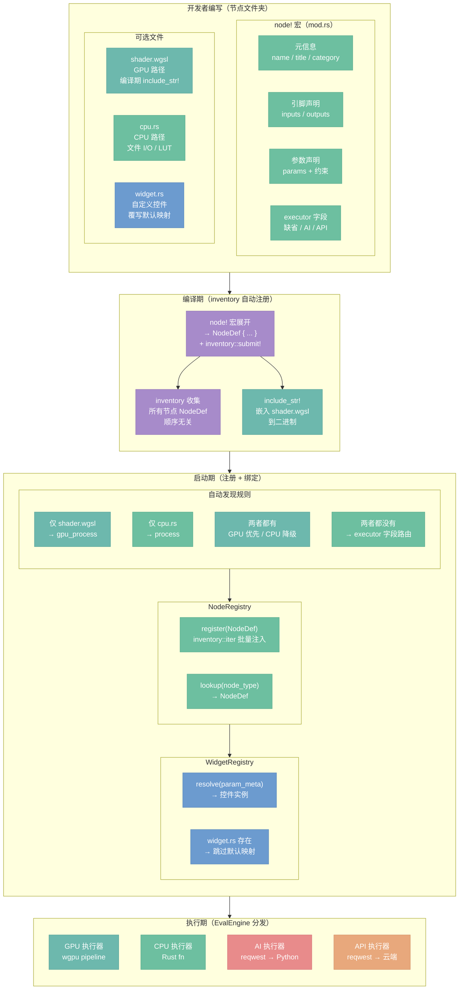
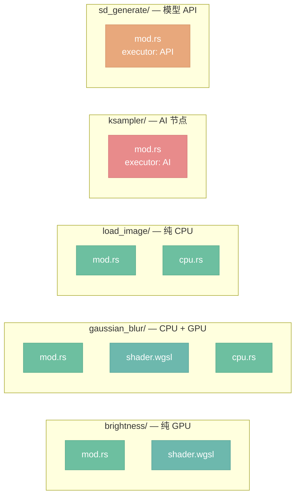

# 节点架构

> 定位：节点开发者体验——如何用最少的代码定义一个新节点。

## 总览



> 开发者只需写 `mod.rs`（node! 宏）+ 可选的 `shader.wgsl` / `cpu.rs`，框架自动完成发现、注册、运行时绑定。

---

## 1. node! 宏语法

`node!` 宏是节点定义的唯一入口，解析元信息并生成 `NodeDef` 和 `inventory::submit!` 调用。

**图像节点示例（brightness）**

```rust
node! {
    name: "brightness",
    title: "亮度",
    category: "颜色校正",
    inputs: [
        image: Image required,
    ],
    outputs: [
        image: Image,
    ],
    params: [
        brightness: Float range(-1.0, 1.0) default(0.0),
    ],
}
```

**AI 节点示例（ksampler）**

```rust
node! {
    name: "ksampler",
    title: "KSampler",
    category: "采样",
    executor: AI,
    inputs: [
        model:    Model    required,
        positive: Cond     required,
        negative: Cond     required,
        latent:   Latent   required,
    ],
    outputs: [
        latent: Latent,
    ],
    params: [
        seed:         Int    default(0),
        steps:        Int    range(1, 150)  default(20),
        cfg:          Float  range(1.0, 30.0) default(7.0),
        sampler_name: String enum("euler", "euler_a", "dpm++", "ddim") default("euler"),
        scheduler:    String enum("normal", "karras", "exponential") default("karras"),
    ],
}
```

> `executor` 字段缺省时为图像节点；设为 `AI` 路由到 Python 后端；设为 `API` 路由到云端 API 执行器。

---

## 2. 文件夹约定

每个节点独占一个文件夹，文件名决定执行方式，不需要在 `mod.rs` 中显式声明。



---

## 3. 自动发现规则

框架在启动时扫描节点文件夹，按以下规则绑定执行方式：

| 文件存在情况 | 执行方式 |
|---|---|
| 仅 `shader.wgsl` | `gpu_process` — 纯 GPU 路径 |
| 仅 `cpu.rs` | `process` — 纯 CPU 路径 |
| `shader.wgsl` + `cpu.rs` 都有 | GPU 为主，CPU 仅在 GPU 不可用时降级 |
| 两者都没有 | 按 `executor` 字段路由（`AI` 或 `API`） |

`shader.wgsl` 通过 `include_str!` 在编译时嵌入二进制，不依赖运行时文件系统。大多数节点只走一条路径（GPU 做像素运算，CPU 做 I/O 和分析），两者协作而非对立。仅当节点同时提供两条路径时，GPU 不可用才会降级到 CPU。

---

## 4. 控件覆写（决策 D24）

框架根据参数��型和约��自动映射到预置控件，99% 的节点无需额外代码。

**预置控件库：**

| 参数类型 + 约束 | 默认控件 |
|---|---|
| `Float` + `range` | `Slider` |
| `Int` + `range` | `IntSlider` |
| `Bool` | `Checkbox` |
| `String` + `enum` | `Dropdown` |
| `String` + `enum`（选项 ≤ 4） | `RadioGroup` |
| `Color` | `ColorPicker` |
| `String` + `file_path` | `FilePicker` |
| `Float`（无约束） | `NumberInput` |

**默认映射由 `WidgetRegistry` 管理：**

```
参数元信息 → WidgetRegistry::resolve() → 控件实例
```

**覆写方式（可选）：**

在节点文件夹内放置 `widget.rs`，实现自定义控件逻辑：

```
curves/
├── mod.rs
├── cpu.rs
└── widget.rs    # 覆写：实现 CurveEditor 曲线编辑控件
```

`widget.rs` 存在时，框架跳过默认映射，直接调用文件中定义的渲染函数。`widget.rs` 不存在则使用 `WidgetRegistry` 自动生成。废弃原有的全局 `widget.rs`，控件逻辑随节点内聚。

---

## 5. Shader 位置（决策 D21）

Shader 文件与节点定义放在同一文件夹，不再集中存放于 `nodeimg-gpu/src/shaders/`。

```
brightness/
├── mod.rs
└── shader.wgsl    ← 与节点内聚，不在 nodeimg-gpu 目录
```

编译时通过 `include_str!("shader.wgsl")` 嵌入，`nodeimg-gpu` 退化为纯运行时（提供 `GpuContext`、pipeline 创建、buffer 管理），不再承载具体的 shader 文本。

这样做的优势：
- 修改节点 shader 时只需打开节点文件夹，不跨目录
- 新增节点无需修改 `shaders.rs` 导出列表
- shader 和元信息一起版本化，删除节点时一并清理

---

## 6. 目录结构

按执行器类型分三个顶层目录，所有节点统一在 Rust 侧定义：

```
crates/nodeimg-engine/src/
├── builtins/                   # 图像处理节点（GPU / CPU）
│   ├── brightness/
│   │   ├── mod.rs              # node! { ... }
│   │   └── shader.wgsl         # 自动绑定为 gpu_process
│   ├── gaussian_blur/
│   │   ├── mod.rs
│   │   ├── shader.wgsl         # GPU 优先
│   │   └── cpu.rs              # CPU 回退
│   ├── load_image/
│   │   ├── mod.rs
│   │   └── cpu.rs              # 自动绑定为 process
│   └── mod.rs                  # inventory::iter 收集
│
├── ai_nodes/                   # AI 自部署节点
│   ├── ksampler/
│   │   └── mod.rs              # node! { ..., executor: AI }
│   ├── load_checkpoint/
│   │   └── mod.rs
│   └── mod.rs
│
└── api_nodes/                  # 模型 API 节点（云端大厂）
    ├── sd_generate/
    │   └── mod.rs              # node! { ..., executor: API }
    ├── dalle_generate/
    │   └── mod.rs
    └── mod.rs
```

---

## 7. Rust / Python 职责分工

节点定义的唯一来源是 Rust 侧，Python 端退化为纯推理服务。

| 职责 | 归属 |
|---|---|
| 节点元信息（名称、引脚、参数、分类） | Rust — `node!` 宏 |
| 参数校验、类型约束 | Rust — `NodeDef` |
| 执行路由决策 | Rust — `EvalEngine` |
| GPU 计算（WGSL shader） | Rust — `nodeimg-gpu` 运行时 |
| CPU 辅助计算（文件 I/O、LUT） | Rust — `nodeimg-processing` |
| 模型推理（SDXL、CLIP、VAE 等） | Python — FastAPI 推理服务 |
| 设备检测（CUDA / MPS / CPU） | Python — `device.py` |

Python 端目录结构：

```
python/
├── server.py      # FastAPI 推理服务
├── executor.py    # 推理执行
├── device.py      # GPU 检测
└── models/        # 模型文件管理
```

> 前端不感知 Python 后端的存在；Python 端不再定义节点，只接收来自 Rust 的执行请求并返回张量数据。

---

## 8. inventory 自动注册（决策 D18）

`node!` 宏在展开时自动插入 `inventory::submit!` 调用，编译期收集所有节点定义，启动时批量注入 `NodeRegistry`。

```
编译期：
  node! 宏展开 → inventory::submit!(NodeDef { ... })
  各节点文件夹独立编译，顺序无关

启动期：
  inventory::iter::<NodeDef>() → 遍历所有收集到��� NodeDef
  → NodeRegistry::register(def)
  → Registry 就绪，Engine 可执行
```

不需要在任何聚合文件中手动列举节点——添加新节点文件夹即自动生效，删除文件夹即自动移除。

插件系统（`.dylib` 动态加载）已从路线图中移除，当前架构不支持运行时加载外部插件。所有节点必须在编译期存在。

---

**相关文档：**
- [`20-engine.md`](20-engine.md) — EvalEngine 执行调度与 NodeRegistry 使用
- [`42-app-editor.md`](42-app-editor.md) — WidgetRegistry 在编辑器中的集成
- [`40-app-overview.md`](40-app-overview.md) — App 总览与节点框架初始化
- [`50-python-protocol.md`](50-python-protocol.md) — AI 执行器与 Python 后端协议
