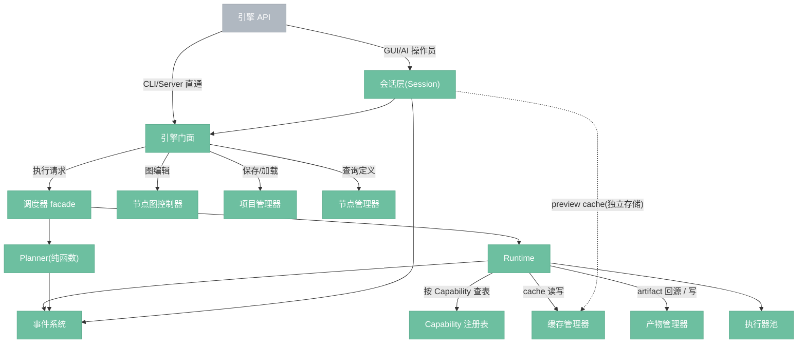

# 节点引擎

> 系统核心,始终本地运行,管理节点图、调度执行、缓存结果。

---

## 总览



---

## 组件清单(targetv2)

| 组件 | 层 | 实例数量 | 生存期 | 来源 |
|------|---|---------|-------|------|
| **引擎 API(EngineFacade)** | Layer 7 | 进程级单例 | 进程启动 → 退出 | target 继承 |
| **会话层(Session)** | Layer 5 | Session 级(首版单例,未来多实例) | Project 打开 → 关闭 | **targetv2 新增** |
| **节点图控制器(GraphController)** | Layer 1 | Session 级 | 与 Session 同 | target 继承(加 with_undo_tracking / without_undo 构造模式) |
| **节点管理器(NodeManager)** | 跨层服务 | 进程级单例 | 启动时注册,M6 冻结 | target 继承 |
| **调度器 facade(SchedulerFacade)** | Layer 2+4 薄层 | Session 级 | 与 Session 同 | **拆分**: 核心职责迁入 Planner + Runtime |
| **Planner** | Layer 2 | Session 级(内部 memoization cache 按 Session 独立) | 与 Session 同 | **targetv2 新增** |
| **Runtime** | Layer 4 | **进程级单例** | 启动 → 退出 | **targetv2 新增** |
| **Capability 注册表** | Layer 3 | 进程级单例 | 启动时注册,M3 冻结 | **targetv2 新增** |
| **执行器池** | Layer 4 | 进程级单例 | 启动时构造,注册到 CapabilityRegistry | target 继承 |
| **缓存管理器(CacheManager)** | Layer 4 | 进程级单例 | 启动 → 退出 | target 继承(拆分预览 cache 归 Session) |
| **产物管理器(ArtifactManager)** | Layer 4 | 进程级单例 | 启动 → 退出 | target 继承 |
| **项目管理器(ProjectManager)** | Layer 6 | 进程级单例 | 启动 → 退出 | target 继承 |
| **事件系统** | 跨层服务 | 进程级单例 | 启动 → 退出 | target 继承 |

**关键非对称:**

- **进程级单例**(GraphController、Capability、Runtime、Cache、Artifact、Project、Event、NodeManager、EngineFacade)——硬件级资源或全局状态共享
- **Session 级**(Session 自身、Planner、Scheduler facade)——与当前 Project 绑定,与 Session 同生同灭
- **Runtime 是进程级**即使有多个 Session:single-flight 守卫在 Runtime,所有 Session 共享一个 Runtime,Session 的请求通过各自的 Scheduler facade 最终汇入同一个 Runtime

**首版约束:** 首版仅支持单 Session。Session 级组件实际也只有一个实例。未来多 Session 需要支持时,Session 级组件按 Session 创建多个实例即可,**不影响核心代码**。

**CLI / Server 模式:** CLI 进程启动时**不**创建 Session,但会创建一个 Scheduler facade 实例(无 Session 版本)。这个 Scheduler facade 也是"Session 级",只是此 Session 为空——生存期等于 CLI 进程的生存期。

---

## 各组件职责

### 引擎 API

三类前端的唯一入口,见 `0.0.1-engine-contract.md`。

### 会话层 Session(新)

一次"打开项目" / "新建 scratch" 的生存期,持有交互性状态。

- **拥有:** undo / redo 栈、preview 热路径缓存、事件订阅注册、当前交互 run handle 引用
- **不拥有:** single-flight 权限、正式 cache
- **CLI / Server 可以不经过 Session**

详见 `4.12.0-session.md`。

### 调度器 facade

target 时代的 Scheduler 在 targetv2 被拆为 Planner(纯函数) + Runtime(副作用),Scheduler 降格为**薄 facade**,负责:

- 接收外部 `ExecutionRequest`
- 调用 Planner 产出 `ExecutionPlan`
- 把 `ExecutionPlan` 交给 Runtime 执行
- 对外保持 `set_mode` / `request_execution` / `cancel_execution` 接口

详见 `4.1.0-scheduler.md`。

### Planner(新)

**纯函数:** `(Graph, CookingContext, DirtyState) → ExecutionPlan`

- 拥有: 依赖分析、脏状态、CookingContext 枚举、ExecSignature 构造
- 不拥有: 实际执行、cache、artifact、取消、进度
- 关键性质: 相同输入产出相同输出,可单元测试,可跨前端复用

详见 `4.1.1-planner.md`。

### Runtime(新)

执行副作用的唯一所在地。

- 拥有: **single-flight 全局守卫**、cache 写入、artifact 写入、Materialization 调度、执行器分发、取消、进度
- 按 Capability 查表路由,不按 `executor_type` switch
- Preview / Full 分路调度: Preview 可抢占 Full
- CLI / Server 可直接调用 Runtime

详见 `4.1.2-runtime.md`。

### Capability 注册表(新)

- 持有 `CapabilityId → Vec<Arc<dyn Executor>>` 路由表
- 启动时注册,不支持运行时热插拔
- Runtime 路由决策的数据源

详见 `4.1.3-capability-registry.md`。

### 节点图控制器 / 节点管理器 / 缓存管理器 / 产物管理器 / 项目管理器 / 事件系统

从 target 继承,targetv2 对这些模块的修订:

- **缓存管理器**: 拆分出 preview cache(归 Session)与正式 cache(归 Runtime);二者不共享存储
- **节点图控制器**: undo / redo 栈的生存期归 Session,逻辑实现可以继续在 GraphController
- **项目管理器**: 明确与 Graph 正交,"无 Project 的 Graph" 合法
- **节点管理器 / 产物管理器 / 事件系统**: 接口无变更

---

## 与 target 的差异

| 差异 | 说明 |
|------|------|
| 调度器拆分 | Scheduler → Scheduler facade + Planner + Runtime |
| Session 独立 | 新层,承载 preview / undo / events |
| Capability 注册表 | 新模块,路由按 Capability 查表 |
| preview cache 独立 | 与正式 cache 不共享存储 |
| Runtime 持有 single-flight | 从 Scheduler 迁入 Runtime |
| NodeRegistry façade | 作为唯一对外扩展入口明文化 |
| 执行器声明 Capability | `Executor::provides()` 方法新增 |

---

## 引擎 API 的路径分叉

```
GUI → Session → Runtime → ExecutorPool → (CacheManager, ArtifactManager)
      ↑                   ↓
      └──── EventBus ◀────┘


CLI → Runtime → ExecutorPool → (CacheManager, ArtifactManager)
       ↓
     stdout / event stream


Server → Runtime → ExecutorPool → (CacheManager, ArtifactManager)
          ↓
        HTTP Response / SSE
```

GUI 的特权(preview 热路径、undo、事件订阅、交互意图翻译)通过 **Session 层**获得。
CLI / Server 不需要这些特权,直接走 Runtime——同样被 `single-flight` 约束。

---

## 与其他文档的关系

- `architecture-invariants.md` —— 8 条真源
- `first-principles-architecture.md` —— 8 层分层
- `0.1.1-execution-models.md` —— 执行共享模型
- `4.1.0-scheduler.md` —— Scheduler facade
- `4.1.1-planner.md` —— Planner
- `4.1.2-runtime.md` —— Runtime
- `4.1.3-capability-registry.md` —— Capability 注册表
- `4.12.0-session.md` —— Session 层
- `4.11.2-executor-contract.md` —— 执行器契约
