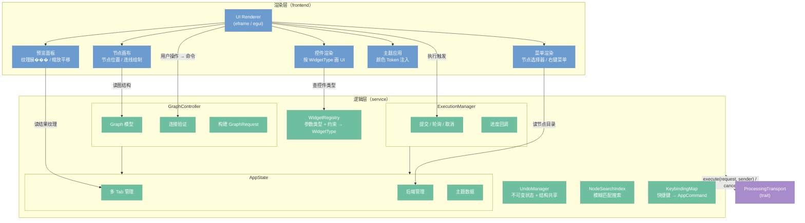
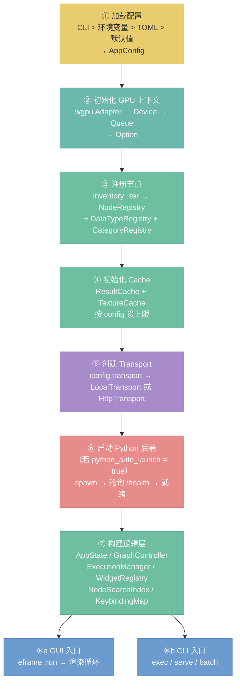

# App 层架构

> 定位：nodeimg-app 的逻辑/渲染分离架构——框架无关的核心逻辑设计和启动关闭流程。

**子系统文档：**
[41-app-execution.md](./41-app-execution.md) · [42-app-editor.md](./42-app-editor.md) · [43-app-theme.md](./43-app-theme.md) · [44-cli.md](./44-cli.md)

---

## 架构总览

`nodeimg-app` 在内部分为两层：**逻辑层**持有所有状态和业务规则，**渲染层**仅负责把状态画到屏幕上。两层之间没有循环依赖——渲染层读取逻辑层的状态，通过事件/命令把用户操作反馈给逻辑层；逻辑层不引用任何 UI 框架类型。



逻辑层通过 `ProcessingTransport` trait 与服务层通信，不感知底层是 `LocalTransport` 还是 `HttpTransport`。详见 [30-transport.md](./30-transport.md)，Python AI 后端协议详见 [50-python-protocol.md](./50-python-protocol.md)。

---

## 逻辑层/渲染层分离

**设计意图：** 渲染层与 `eframe/egui` 强耦合，逻辑层不引用任何框架类型。当 UI 框架迁移（如切换到 Web 前端或原生 UI 工具包）时，逻辑层可以整体复用，只需为新框架重新实现渲染层。

**分离边界：**

| 职责 | 归属 |
|------|------|
| 图状态、节点参数、项目文件 | 逻辑层 |
| 连接合法性验证 | 逻辑层（GraphController） |
| 控件类型映射 | 逻辑层（WidgetRegistry） |
| 参数校验（范围、枚举合法性） | 逻辑层（WidgetRegistry） |
| 将状态画成像素 | 渲染层 |
| 框架事件处理（鼠标/键盘） | 渲染层 |
| 主题颜色的实际注入 | 渲染层（ThemeApply） |

**通信方式：** 渲染层不直接修改逻辑层状态——用户操作通过命令对象（`AppCommand` 枚举）传入逻辑层，逻辑层统一处理后更新状态，渲染层在下一帧读取新状态。这与 Elm/Redux 的单向数据流类似，便于调试和回放。

---

## 启动序列

GUI 和 CLI 共享核心初始化流程（步骤 1–7），仅末尾入口不同。



**关键说明：**

- **步骤②** GPU 初始化可能失败（无兼容 GPU 或驱动问题），此时 `GpuContext` 为 `None`，所有 GPU 节点回退到 CPU 路径。App 正常启动，不阻塞。
- **步骤⑥** Python 后端是可选依赖。启动失败或超时（30 秒）后 App 仍正常运行，AI 节点灰显不可用，图像处理节点不受影响。详见 [50-python-protocol.md](./50-python-protocol.md)。
- **步骤⑤→⑥ 顺序依赖**：`LocalTransport` 需要持有 `BackendClient`（AI 执行器的 HTTP 客户端），因此 Transport 创建在 Python 启动之前，但 `BackendClient` 的连接验证在 Python 就绪后才完成。

---

## 关闭序列

```
App 退出
  │
  ├─ ① 取消所有正在执行的任务（设置 CancelToken）
  ├─ ② 等待后台执行线程退出
  ├─ ③ 关闭 Python 后端
  │     ├─ SIGTERM
  │     ├─ 等待 5 秒
  │     └─ 未退出 → SIGKILL
  ├─ ④ 释放 GPU 资源（GpuContext drop）
  └─ ⑤ ��出进程
```

未保存的项目在渲染层关闭窗口时拦截（`eframe` 的 `on_close_event`），弹出保存确认对话框，不在关闭序列中处理。
