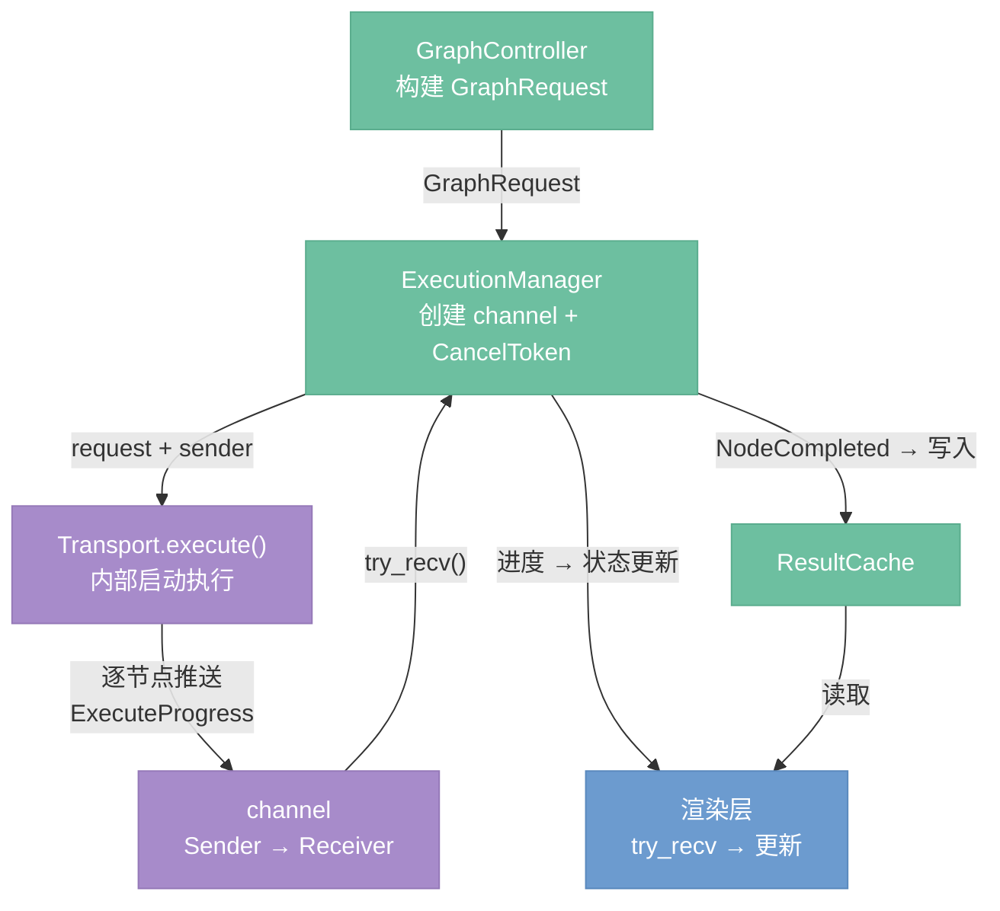
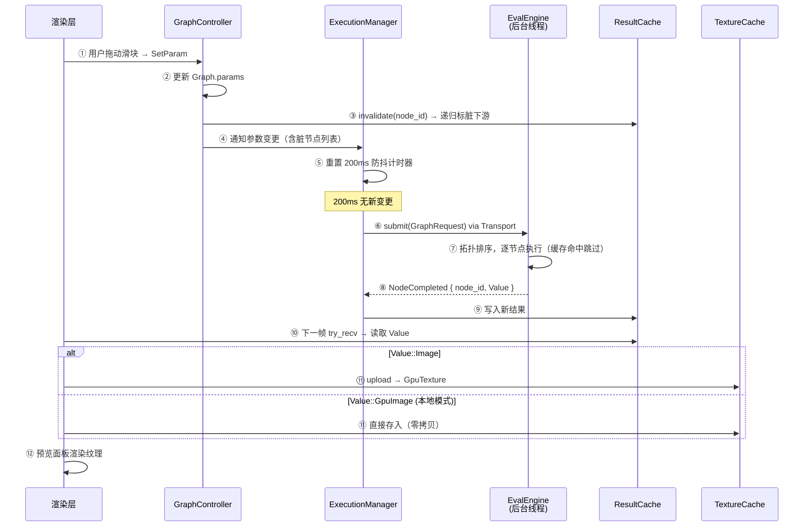

# 执行管理

> 定位：ExecutionManager——图执行的全生命周期管理：提交、进度追踪、取消、结果收割、自动执行策略。

---

## 架构总览

`ExecutionManager` 负责管理图执行的全生命周期：提交、进度追踪、取消、结果收割。



---

## 提交流程

1. `GraphController` 将当前图构建为 `GraphRequest`。
2. `ExecutionManager` 创建 channel（`Sender` + `Receiver`）和 `CancelToken`。
3. 调用 `Transport.execute(request, sender)`，Transport 在内部启动执行，通过 `Sender` 逐节点推送进度。
4. `AppState.executing = true`，UI 展示执行中状态。

---

## 进度消费（channel 模式）

`ExecutionManager` 在每帧的 `update()` 中非阻塞地 `try_recv()` 所有待读事件：

| 事件 | 含义 |
|------|------|
| `ExecuteProgress::NodeStarted { node_id }` | 某节点开始执行，UI 高亮该节点 |
| `ExecuteProgress::NodeCompleted { node_id, outputs }` | 某节点执行完毕，结果写入 `ResultCache` |
| `ExecuteProgress::NodeFailed { node_id, error }` | 某节点执行失败，UI 展示错误标记 |
| `ExecuteProgress::Progress { node_id, step, total }` | AI 节点迭代进度（Transport 内部将 Python SSE 转发到 channel） |
| `ExecuteProgress::Finished` | 全图执行完成，清除执行状态 |
| `ExecuteProgress::Cancelled` | 执行已取消 |

ExecutionManager 只面向 channel，不感知底层是 `LocalTransport`（同进程直调）还是 `HttpTransport`（HTTP + SSE）。HttpTransport 在内部将 TaskId + poll SSE 流转换为 channel 推送，对上层透明。

---

## 取消机制

`ExecutionManager` 持有 `CancelToken`（内部为 `Arc<AtomicBool>`）。调用 `cancel()` 设置标志位；`LocalTransport` 的后台执行线程在每个节点间隙检查标志提前退出，`HttpTransport` 调用 `/cancel/{task_id}` 通知远端。取消后 `AppState.executing = false`，UI 恢复空闲状态。

---

## 结果存放

所有 `NodeCompleted` 事件携带的结果由 `ExecutionManager` 写入 `ResultCache`（`AppState` 持有引用）。渲染层在下一帧从 `ResultCache` 读取预览数据，通过 `TextureCache` 转为 GPU 纹理展示。

---

## 自动执行策略（决策 D35）

参数变更后的执行触发策略按执行器类型分为两路：

| 执行器类型 | 触发方式 | 行为 |
|-----------|---------|------|
| Image（GPU/CPU） | 自动，200ms 防抖 | 参数变更后 200ms 内无新变更则自动提交脏子图（变更节点 + 下游） |
| AI / API | 手动，Ctrl+Enter | 不自动执行，用户显式触发 |

**防抖机制：** 用户拖动滑块时每帧都产生参数变更事件，`ExecutionManager` 收到变更后重置 200ms 计时器，只在用户停止操作后才提交执行请求。计时器在逻辑层管理，渲染层只负责转发参数变更事件。

**Ctrl+Enter 手动执行：** 提交整图给 `EvalEngine`，引擎内部对缓存命中的节点自动跳过，等效于只重新执行参数已变更但未执行的节点。用户不需要理解"哪些节点过期"——按一次 Ctrl+Enter 就能把整图跑到最新状态。

**过期结果处理：** AI/API 节点的上游参数变更后，旧的执行结果保留在 `ResultCache` 中，预览继续显示旧图像，不做过期视觉提示。直到用户手动触发执行，新结果替换旧结果。这与 ComfyUI 的行为一致——用户对 AI 节点的执行时机有完全控制权。

**混合图场景示例：**

```
LoadCheckpoint → KSampler → VAEDecode → Brightness → SaveImage
     (AI)          (AI)        (AI)       (GPU)        (CPU)
```

用户将 Brightness 的值从 0.3 改为 0.5：
1. `GraphController` 标记 Brightness 及下游 SaveImage 为脏
2. 200ms 防抖后，`ExecutionManager` 自动提交脏子图
3. Brightness 和 SaveImage 重新执行，预览立即更新
4. AI 节点不受影响，保留缓存结果

用户将 KSampler 的 steps 从 20 改为 30：
1. `GraphController` 标记 KSampler 及下游为脏，但 KSampler 是 AI 节点
2. 不触发自动执行，预览保留旧图像
3. 用户按 Ctrl+Enter → 整图执行，LoadCheckpoint 缓存命中跳过，KSampler 以新参数重新采样，下游全部更新

---

## 预览更新链路

参数变更到屏幕像素刷新的端到端路径，涉及逻辑层、服务层和渲染层三层协作：



**关键设计点：**

- **步骤③ 缓存失效是同步的**：`invalidate` 在 UI 线程中立即执行，递归标脏下游节点，不等待后台执行完成。
- **步骤⑧→⑨ 逐节点增量更新**：每个节点完成后立即写入 `ResultCache`，渲染层在下一帧就能读取到中间结果，实现逐节点刷新预览，而非等待整图执行完毕。
- **步骤⑪ 纹理上传的两条路径**：`LocalTransport` 模式下 GPU 节点直接产出 `GpuImage`，不经过 CPU 回读；`HttpTransport` 模式下收到序列化的 `Image` 字节，需要 CPU→GPU 上传。
- **TextureCache 淘汰不阻塞预览**：纹理被 LRU 淘汰后，下次访问时从 `ResultCache` 的 `Image` 重新上传，代价低于重新执行节点。

---

## 设计决策

- **D23**: ExecutionManager 基于 channel 的进度消费——每帧非阻塞 `try_recv()`，不感知底层 Transport 实现，LocalTransport 与 HttpTransport 对上层透明。
- **D35**: Image 节点自动执行 200ms 防抖，AI/API 节点手动 Ctrl+Enter——将执行控制权归还用户，避免 AI 节点频繁触发高成本推理。
