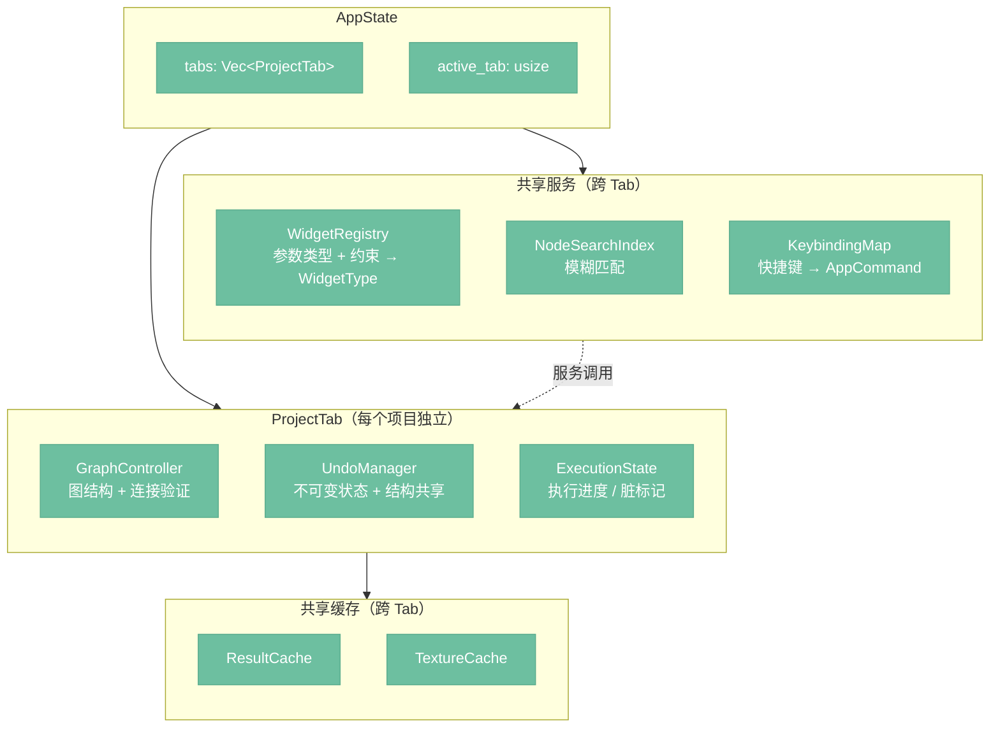
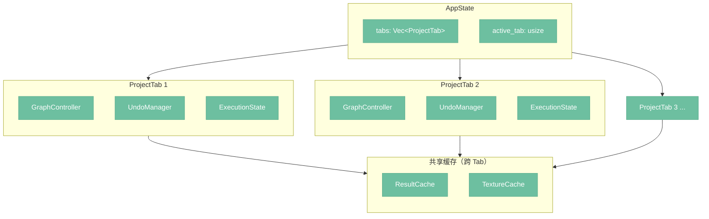
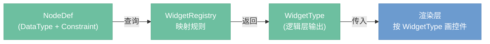
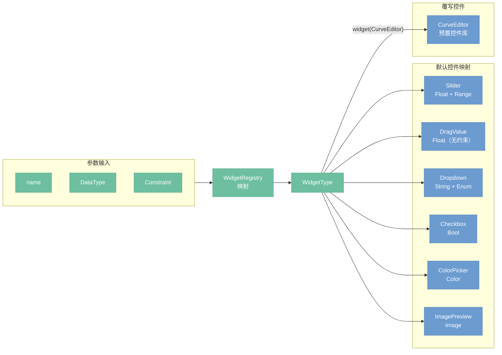
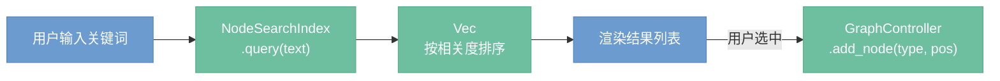

# 编辑器交互

> 定位：App 的编辑交互子系统——项目管理、参数编辑、撤销、搜索、快捷键。

---

## 架构总览

编辑器交互子系统以 `AppState` 为根，管理多个 `ProjectTab`，每个 Tab 拥有独立的图控制器、撤销历史和执行状态；`WidgetRegistry`、`NodeSearchIndex`、`KeybindingMap` 作为跨 Tab 共享服务；`ResultCache` 与 `TextureCache` 也跨 Tab 共享以避免 VRAM 重复占用。



---

## 多项目 Tab（决策 D34）

App 支持同时打开多个项目，每个项目独立一个 tab，类似浏览器标签页。



```rust
struct AppState {
    tabs: Vec<ProjectTab>,
    active_tab: usize,
    // ResultCache 和 TextureCache 跨 tab 共享
}

struct ProjectTab {
    title: String,
    file_path: Option<PathBuf>,
    graph_controller: GraphController,
    undo_manager: UndoManager,
    execution_state: ExecutionState,
    dirty: bool,  // 有未保存修改
}
```

**关键设计：**

- 每个 tab 有独立的 `GraphController`、`UndoManager`、执行状态——切换 tab 不丢失任何上下文
- `dirty` 标记未保存修改，关闭 tab 时提示保存
- 执行是 tab 级别的——一个 tab 在执行时可以切换到另一个 tab 编辑，不阻塞
- `ResultCache` 和 `TextureCache` 跨 tab 共享，避免 VRAM 重复占用，缓存条目通过 `(TabId, NodeId)` 区分归属

---

## Undo/Redo（决策 D32）

`UndoManager` 基于不可变状态 + 结构共享实现，每次操作生成新版本的 `GraphState`，旧版本入 undo 栈。节点通过 `Arc<Node>` 持有，修改时只 clone 被改的节点，未改变的节点在版本间共享引用。

```rust
struct UndoManager {
    undo_stack: Vec<GraphState>,  // 旧版本
    redo_stack: Vec<GraphState>,  // 被撤销的版本
    max_steps: usize,             // 上限（默认 100）
}

struct GraphState {
    nodes: HashMap<NodeId, Arc<Node>>,
    connections: Vec<Connection>,
    // 不含缓存和图像数据
}
```

**操作流程：**


**进入 undo 栈的操作：** 添加/删除节点、连线/断线、修改参数、移动节点。

**不进入 undo 栈的操作：** 执行图（结果缓存不回滚）、保存文件、缩放/平移画布。

**归属：** 逻辑层。`UndoManager` 是 `ProjectTab` 的成员，每个项目 tab 独立维护自己的撤销历史。

---

## WidgetRegistry（决策 D20）

`WidgetRegistry` 属于**逻辑层**，不属于渲染层。

**原因：** 控件类型的选择依赖对数据类型和约束的理解（例如：`Float + Range` 约束应映射为滑块，`Enum` 应映射为下拉框）。这是业务规则，不是渲染细节。若放入渲染层，每次框架迁移都需要重新实现控件映射逻辑，且无法独立测试。

**分工说明：**

- `nodeimg-engine`（服务层）：通过 `NodeDef` 提供每个参数的 `DataType` 和 `Constraint`。
- `WidgetRegistry`（逻辑层）：根据 `DataType + Constraint` 的组合，映射为 `WidgetType` 枚举值。
- 渲染层：只接收 `WidgetType`，不做类型判断，直接调用对应的 egui 绘制函数。



**映射示例：**

| DataType | Constraint | WidgetType |
|----------|-----------|------------|
| `Float` | `Range(min, max)` | `Slider` |
| `Float` | 无 | `DragValue` |
| `Int` | `Range(min, max)` | `SliderInt` |
| `String` | `Enum(variants)` | `Dropdown` |
| `Bool` | — | `Checkbox` |
| `Color` | — | `ColorPicker` |
| `Image` | — | `ImagePreview` |

---

## 节点渲染器（决策 D24）

节点渲染器负责把单个节点的 `NodeDef`（参数列表）画成可交互的控件组。控件类型由 `WidgetRegistry` 决策，渲染层执行绘制。

**参数类型到控件的映射流程：**



**控件覆写机制（决策 D24）：**

`node!` 宏允许节点定义时显式指定某个参数的控件类型，覆盖 `WidgetRegistry` 的默认映射：

```rust
node! {
    name: "ColorGrade",
    params: [
        param!("curve", DataType::Float, widget: CurveEditor),
        param!("strength", DataType::Float, Constraint::Range(0.0, 1.0)),
    ],
    ...
}
```

`widget: CurveEditor` 直接绑定到预置控件库中的 `CurveEditor` 组件，渲染层无需经过 `WidgetRegistry` 查表。不指定 `widget` 的参数走默认映射路径。

**`widget.rs` 的废除（决策 D24）：** 原有的 `widget.rs` 将所有控件逻辑集中在一个文件中，导致增加新控件时需要修改中心文件，且控件与参数类型之间的关联隐式存在。新方案中，控件选择要么由 `WidgetRegistry` 的映射表决定（数据驱动，可测试），要么在 `node!` 宏中显式声明（局部可见，零隐式依赖）。`widget.rs` 不再承担控件路由职责。

---

## 节点搜索

双击画布空白处或按 Space 唤出搜索浮窗，输入关键词实时过滤节点列表，回车将选中节点添加到画布。



**搜索范围：**

- 节点名称（如 "KSampler"）
- 节点分类（如 "采样"）
- 关键词/别名（如输入 "blur" 匹配到 "Blur"）

**搜索算法：** 模糊匹配（子串匹配），结果按相关度排序——名称精确匹配优先，分类匹配次之。

**归属：** 逻辑层提供 `NodeSearchIndex`（启动时从 `NodeRegistry` 构建），渲染层只负责绘制搜索框和结果列表。

---

## 键盘快捷键（决策 D33）

逻辑层维护 `KeybindingMap`，映射快捷键组合到 `AppCommand` 枚举。渲染层捕获键盘事件后查表触发对应命令，不硬编码任何快捷键。

**默认快捷键：**

| 快捷键 | 命令 |
|--------|------|
| Ctrl+Z | Undo |
| Ctrl+Shift+Z | Redo |
| Ctrl+S | 保存项目 |
| Ctrl+O | 打开项目 |
| Ctrl+N | 新建项目 |
| Delete / Backspace | 删除选中节点/连线 |
| Ctrl+A | 全选 |
| Ctrl+C / Ctrl+V | 复制/粘贴节点 |
| Ctrl+D | 复制选中节点 |
| Space 或双击画布 | 唤出节点搜索 |
| Ctrl+Enter | 执行图 |
| Escape | 取消执行 / 关闭搜索 |
| Ctrl+T | 新建 tab |
| Ctrl+W | 关闭当前 tab |
| Ctrl+Tab | 切换到下一个 tab |

**可自定义：** 快捷键配置存在 `config.toml` 的 `[keybindings]` 段中，用户可覆盖默认值。添加新快捷键只需在 `AppCommand` 枚举增加变体并在默认映射表加一行，不影响渲染层。
