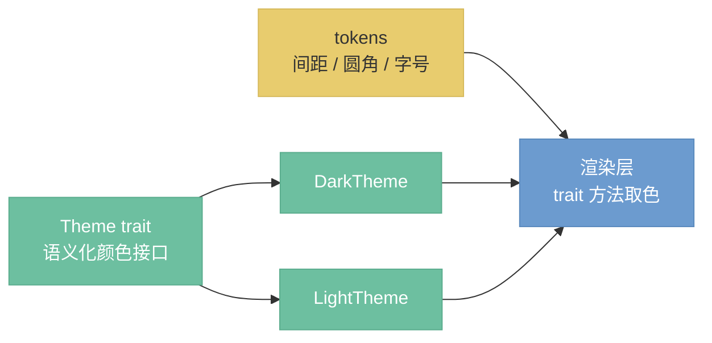

# 主题系统

> 定位：语义化颜色接口——Theme trait 定义配色，Dark/Light 实现，渲染层只取色不硬编码。

---

## 架构总览

主题通过 `Theme` trait 定义语义化颜色接口，具体配色由 `DarkTheme` / `LightTheme` 实现。逻辑层持有 `Arc<dyn Theme>`，渲染层每帧调用 trait 方法取色，不硬编码任何颜色值。



---

## Theme trait

```rust
pub trait Theme: Send + Sync {
    // ── 全局 ──
    fn canvas_bg(&self) -> Color32;           // 画布背景
    fn panel_bg(&self) -> Color32;            // 侧边面板背景
    fn panel_separator(&self) -> Color32;     // 面板分割线
    fn accent(&self) -> Color32;              // 强调色（选中、焦点）
    fn accent_hover(&self) -> Color32;        // 强调色悬停态

    // ── 文字 ──
    fn text_primary(&self) -> Color32;        // 主文字
    fn text_secondary(&self) -> Color32;      // 次要文字（标签、提示）

    // ── 节点 ──
    fn node_body_fill(&self) -> Color32;      // 节点体背景
    fn node_body_stroke(&self) -> Stroke;     // 节点体边框
    fn node_shadow(&self) -> Shadow;          // 节点投影
    fn node_header_text(&self) -> Color32;    // 节点标题文字
    fn category_color(&self, cat_id: &str) -> Color32;  // 节点头部按分类着色
    fn pin_color(&self, data_type: &str) -> Color32;    // 引脚按数据类型着色

    // ── 控件 ──
    fn widget_bg(&self) -> Color32;           // 控件背景
    fn widget_hover_bg(&self) -> Color32;     // 控件悬停背景
    fn widget_active_bg(&self) -> Color32;    // 控件激活背景

    // ── 框架注入 ──
    fn apply(&self, ctx: &egui::Context);     // 注入 egui 全局视觉样式
    fn node_header_frame(&self, cat_id: &str) -> Frame;  // 节点头部 Frame
    fn node_body_frame(&self) -> Frame;       // 节点体 Frame
}
```

---

## 语义化颜色映射

**节点头部颜色**——按分类（`CategoryId`）区分，用户一眼识别节点类型：

| 分类 | 色调 | 用途 |
|------|------|------|
| data | 蓝 | 文件 I/O（LoadImage、SaveImage） |
| generate | 紫 | 图像生成（纯色、渐变、噪声） |
| color | 橙 | 调色（亮度、曲线、色相） |
| transform | 绿 | 变换（缩放、裁剪、旋转） |
| filter | 粉 | 滤镜（模糊、锐化、降噪） |
| composite | 金 | 合成（混合、蒙版） |
| tool | 灰 | 工具（预览、直方图） |
| ai | 紫红 | AI 节点（采样、模型加载） |

**引脚颜色**——按数据类型（`DataTypeId`）区分，用户通过颜色匹配判断连线兼容性：

| 数据类型 | 色调 | 说明 |
|---------|------|------|
| image | 蓝 | 像素图像 |
| mask | 青绿 | 蒙版 |
| float | 橙 | 浮点数 |
| int | 青 | 整数 |
| string | 灰 | 字符串 |
| color | 紫 | 颜色 |
| boolean | 红 | 布尔 |
| model | 亮紫 | Diffusion 模型（Handle） |
| clip | 金 | CLIP 模型（Handle） |
| vae | 红 | VAE 模型（Handle） |
| conditioning | 淡紫 | 条件化信息（Handle） |
| latent | 粉 | 潜空间张量（Handle） |

---

## Design Tokens

布局常量独立于颜色，定义在 `tokens` 模块中，Dark/Light 主题共用：

| Token | 值 | 用途 |
|-------|---|------|
| 节点圆角 | 6px | 节点体和头部的圆角半径 |
| 节点最小宽度 | 180px | 节点在画布上的最小宽度 |
| 引脚半径 | 5px | 输入/输出引脚圆点的半径 |
| 面板内边距 | 8px | 侧边面板的内边距 |
| 控件间距 | 4px | 节点内参数控件之间的垂直间距 |

---

## 归属与切换

- `Arc<dyn Theme>` 由 `AppState`（逻辑层）持有，渲染层通过引用访问
- 切换主题通过 `AppCommand::ToggleTheme` 触发，替换 `Arc` 引用，下一帧全局生效
- 新增主题只需实现 `Theme` trait，不修改渲染层代码

---

## 设计决策

- **D36**: Theme 通过 trait 定义语义化颜色接口——将配色决策与渲染逻辑解耦，渲染层只取色不硬编码；新增主题不影响渲染层，框架迁移时主题实现可直接复用。
