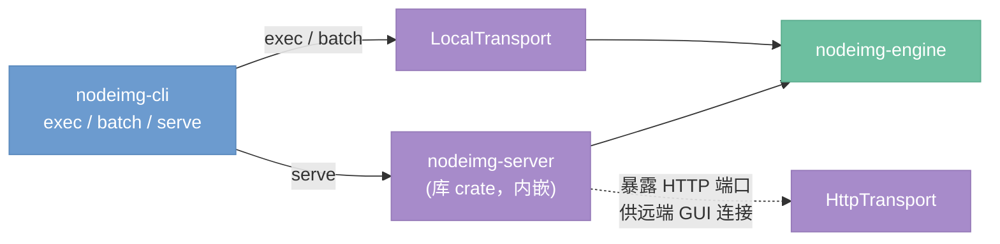

# nodeimg-cli

> 定位：命令行前端——面向无界面场景的 exec/serve/batch 子命令，复用 ProcessingTransport 与服务层交互。

---

## 架构总览

`nodeimg-cli` 是与 GUI 并列的另一个前端，面向无界面场景。它复用 `ProcessingTransport` trait 与服务层交互，不依赖任何 UI 框架。Transport 层详见 [30-transport.md](./30-transport.md)。



---

## exec 子命令

执行单个项目文件并将结果写入文件系统。

```
nodeimg exec workflow.nodeimg [选项]

选项：
  --output, -o <dir>          输出目录（默认：项目文件同级目录）
  --transport <local|http>    传输模式（默认：local）
  --server-url <url>          HTTP 模式下的服务端地址
  --param <node_id>.<key>=<value>  覆盖节点参数（可多次指定）
  --no-python                 跳过 Python 后端启动，AI 节点标记为失败
```

**执行流程：**

1. 加载 `config.toml` + CLI 参数合并为 `AppConfig`
2. 根据 `transport` 配置创建 `LocalTransport` 或 `HttpTransport`
3. 调用 `Transport.load_graph()` 加载项目文件
4. 应用 `--param` 覆盖指定节点参数
5. 调用 `Transport.execute()`，在 stderr 输出逐节点进度
6. SaveImage 节点的输出写入 `--output` 目录
7. 退出码：0 = 全部成功，1 = 部分节点失败，2 = 图加载失败

---

## serve 子命令

启动 HTTP 服务端，供远端 GUI 或其他客户端连接。内嵌 `nodeimg-server` 库 crate。

```
nodeimg serve [选项]

选项：
  --port, -p <port>           监听端口（默认：8080）
  --host <addr>               绑定地址（默认：127.0.0.1）
  --no-python                 不自动启动 Python 后端
```

**行为：**

- 启动 `nodeimg-engine` 服务层 + `nodeimg-server` HTTP 包装层
- 暴露 [30-transport.md](./30-transport.md) 中定义的交互服务（4 个）和计算服务（5 个）端点
- 按 `python_auto_launch` 配置决定是否拉起 Python 后端
- stdout 输出结构化日志（tracing），Ctrl+C 优雅关闭

---

## batch 子命令

批量执行多个项目文件。

```
nodeimg batch ./projects/*.nodeimg [选项]

选项：
  --output, -o <dir>          输出根目录（每个项目创建子目录）
  --jobs, -j <N>              并行执行数（默认：1）
  --continue-on-error         某个项目失败后继续执行其余项目
  --param <node_id>.<key>=<value>  覆盖参数（应用到所有项目）
```

**行为：**

- 扫描匹配的 `.nodeimg` 文件，按 `--jobs` 控制并行度
- 每个项目独立执行，等同于单独调用 `exec`
- `--continue-on-error` 时跳过失败项目，最终汇总报告
- 退出码：0 = 全部成功，1 = 有失败项目

---

## 与 GUI 的共享与差异

| 维度 | GUI (nodeimg-app) | CLI (nodeimg-cli) |
|------|-------------------|-------------------|
| Transport | `LocalTransport`（默认）或 `HttpTransport` | 同左 |
| 进度反馈 | UI 渲染进度条 + 节点高亮 | stderr 文本进度 |
| 多项目 | Tab 并行编辑 | `batch --jobs` 并行执行 |
| 交互 | 实时编辑、预览、Undo | 无交互，一次性执行 |
| 依赖 | eframe / egui | 无 UI 依赖 |
| 使用场景 | 日常创作 | CI/CD 流水线、脚本化批处理 |
