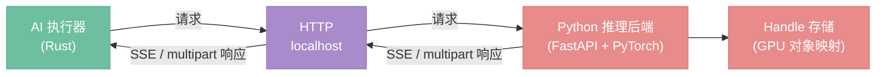
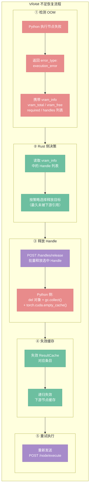

# Python 后端协议

> 定位：AI 执行器与 Python 推理后端之间的通信协议——接口契约、数据格式、Handle 管理、VRAM 恢复。

详见 [22-executor-ai.md](./22-executor-ai.md)（Rust 侧 AI 执行器）
详见 [20-engine.md](./20-engine.md)（Handle 缓存策略）
详见 [10-types.md](./10-types.md)（类型边界）

## 架构总览



> 此通信通道是引擎内部组件之间的通信（AI 执行器 ↔ Python），与 `30-transport.md` 中的 `ProcessingTransport`（前端 ↔ 服务层）完全独立。

---

## 接口总览

| 接口 | 方法 | 用途 | 响应类型 |
|------|------|------|----------|
| `/health` | GET | 设备状态、VRAM、Handle 统计、协议版本 | JSON |
| `/node/execute` | POST | 执行单个 AI 节点 | SSE 流（Handle 输出）或 multipart（Image 输出） |
| `/node/cancel/{execution_id}` | POST | 取消正在执行的节点 | JSON |
| `/handles/release` | POST | 批量释放 Handle | JSON |

Rust 端可并发发送多个 `/node/execute` 请求（对无依赖的 AI 节点），Python 端维护执行队列，根据 GPU 负载决定串行或并行执行。

---

## /health

**请求：** `GET /health`

**响应：**

```json
{
  "protocol_version": "1.0",
  "device": "cuda",
  "gpu_name": "RTX 4090",
  "vram_total_mb": 24576,
  "vram_free_mb": 18432,
  "handles": [
    {"id": "load_checkpoint_model_0001", "data_type": "model", "vram_mb": 6800},
    {"id": "clip_encode_conditioning_0002", "data_type": "conditioning", "vram_mb": 12}
  ]
}
```

**用途：**

- **启动时：** Rust 轮询此接口确认 Python 就绪，校验 `protocol_version` 兼容性
- **VRAM 不足时：** Rust 调用此接口获取 Handle 列表和 VRAM 占用，决定释放哪些 Handle 后重试
- **UI 展示：** GPU 名称、VRAM 剩余等信息可展示给用户

---

## /node/execute

### 请求

`POST /node/execute`，`Content-Type: multipart/form-data`

Part 1（JSON）：

```json
{
  "execution_id": "exec_001",
  "node_type": "ksampler",
  "inputs": {
    "model": {"handle": "load_checkpoint_model_0001"},
    "positive": {"handle": "clip_encode_conditioning_0002"},
    "negative": {"handle": "clip_encode_conditioning_0003"},
    "latent_image": {"handle": "empty_latent_latent_0004"}
  },
  "params": {
    "seed": 42,
    "steps": 20,
    "cfg": 7.0,
    "sampler_name": "euler",
    "scheduler": "karras"
  }
}
```

Part 2+（binary，可选）：当输入包含 Image 类型时（如 img2img 场景），图像原始字节作为独立 part，JSON 中对应字段引用 part 名称：`{"image_part": "input_image"}`。

### 响应——Handle 输出（SSE 流）

当节点输出为 Python 专属类型（Model、Conditioning、Latent 等）时，返回 SSE 流：

```
event: progress
data: {"step": 1, "total": 20}

event: progress
data: {"step": 5, "total": 20, "preview": "<base64 低分辨率预览>"}

event: progress
data: {"step": 20, "total": 20}

event: result
data: {"outputs": {"latent": {"handle": "ksampler_latent_0005", "data_type": "latent"}}}

event: done
data: {}
```

- `progress` 事件：迭代节点每步推送，`preview` 字段可选，由节点实现决定是否发送
- `result` 事件：执行结果，输出为 Handle 引用
- `done` 事件：流结束标记
- 非迭代节点（如 LoadCheckpoint）直接推送 `result` + `done`，不发 `progress`

### 响应——Image 输出（multipart）

当节点输出为 Image 时（如 VAEDecode），返回 `multipart/form-data`：

- Part 1（JSON）：`{"outputs": {"image": {"width": 1024, "height": 1024, "format": "png"}}}`
- Part 2（binary）：图像原始字节

不走 SSE，因为 Image 输出节点通常是一次性计算，不需要进度反馈，且图像数据是 binary。

### 错误响应

通过 SSE `error` 事件或 JSON 响应返回，`error_type` 字段区分三类错误：

```
event: error
data: {"error_type": "execution_error", "message": "CUDA out of memory"}
```

| error_type | 含义 | Rust 侧处理 |
|---|---|---|
| `execution_error` | 节点执行失败（CUDA OOM、模型文件不存在等） | 标红节点，向 UI 报告 |
| `handle_error` | Handle ID 不存在或已释放 | 失效对应缓存条目，重新执行上游 |
| `system_error` | Python 内部异常 | 全局通知，提示用户检查后端 |

三类错误与 `61-error-handling.md` 的分层 Error 体系对齐：`execution_error` 和 `handle_error` 映射为 `NodeError`，`system_error` 映射为 `TransportError`。

---

## /node/cancel/{execution_id}

**请求：** `POST /node/cancel/exec_001`

**响应：**

```json
{"status": "cancelled"}
```

或 execution_id 不存在/已完成时：

```json
{"status": "not_found"}
```

**机制：** Python 端收到取消请求后设置标志位，迭代节点（如 KSampler）在每步采样前检查该标志，命中则中断循环，SSE 流推送 `cancelled` 事件后关闭：

```
event: cancelled
data: {}
```

非迭代节点执行时间短且不可中断，取消请求可能在执行完成后才到达，此时返回 `not_found`。

---

## /handles/release

**请求：** `POST /handles/release`

```json
{"ids": ["load_checkpoint_model_0001", "clip_encode_conditioning_0002"]}
```

**响应：**

```json
{
  "released": ["load_checkpoint_model_0001", "clip_encode_conditioning_0002"],
  "not_found": []
}
```

**调用时机（由 Rust 端 ResultCache 驱动）：**

- 用户修改节点参数 → 该节点及下游缓存失效 → 失效条目中类型为 Handle 的，批量调用 release
- 用户删除节点或断开连接 → 同上
- VRAM 不足重试时 → Rust 主动选择释放目标后调用
- Python 崩溃重启后 → 无需调用（Python 端 VRAM 已随进程释放），Rust 端直接清除 Handle 缓存条目

`not_found` 的 ID 不视为错误——可能是 Python 重启后 Rust 端残留的旧引用，静默忽略。

---

## Handle 机制

Rust 不持有任何 GPU 数据，只持有不透明的 string ID。Handle 在节点间作为输入透传——Rust 从 ResultCache 取出上游的 `Value::Handle`，序列化为 `{"handle": "..."}` 发给 Python。

### Rust 侧

```rust
Value::Handle { id: String, data_type: DataTypeId }
```

### Python 侧

```python
handle_store: dict[str, Any]  # handle_id → GPU 对象（Tensor / Model / VAE 等）
```

收到 `/node/execute` 请求时，Python 从 handle_store 还原输入 Handle 为真实 GPU 对象，执行节点函数，将输出中的 Python 专属类型存入 handle_store 并返回新 handle_id。

### 生命周期规则

与 `20-engine.md` 对齐：

- Handle 生命周期 = 对应 ResultCache 条目的生命周期
- 缓存失效时，Rust 调用 `/handles/release` 通知 Python 释放
- Handle 条目豁免 LRU 淘汰（重建代价远高于普通图像缓存）
- Python 崩溃 → Rust 清除所有 Handle 缓存条目，下次执行时自动重建

### Handle ID 格式

`{node_type}_{output_pin}_{自增计数器}`

| 示例 | 来源 |
|------|------|
| `load_checkpoint_model_0001` | LoadCheckpoint 输出的 model |
| `clip_encode_conditioning_0002` | CLIPTextEncode 输出的 conditioning |
| `ksampler_latent_0005` | KSampler 输出的 latent |

计数器由 Python 端全局自增，保证唯一性。格式便于调试时追踪来源。

---

## SSE 事件流格式

```
迭代节点（如 KSampler）:
  event: progress    data: {"step": 1, "total": 20}
  event: progress    data: {"step": 5, "total": 20, "preview": "<base64>"}
  ...
  event: result      data: {"outputs": {"latent": {"handle": "ksampler_latent_0005", "data_type": "latent"}}}
  event: done        data: {}

非迭代节点（如 LoadCheckpoint）:
  event: result      data: {"outputs": {"model": {"handle": "load_checkpoint_model_0001", "data_type": "model"}}}
  event: done        data: {}

Image 输出节点（如 VAEDecode）:
  → 不走 SSE，返回 multipart/form-data
  Part 1: {"outputs": {"image": {"width": 1024, "height": 1024, "format": "png"}}}
  Part 2: <image bytes>

错误:
  event: error       data: {"error_type": "execution_error", "message": "CUDA out of memory", "vram_info": {...}}

取消:
  event: cancelled   data: {}
```

---

## VRAM 管理

当 Python 端执行节点遇到 VRAM 不足时，返回携带 VRAM 信息的错误：

```
event: error
data: {
  "error_type": "execution_error",
  "message": "CUDA out of memory",
  "vram_info": {
    "vram_total_mb": 24576,
    "vram_free_mb": 1200,
    "required_mb": 6800,
    "handles": [
      {"id": "load_checkpoint_model_0001", "data_type": "model", "vram_mb": 6800},
      {"id": "load_checkpoint_model_0008", "data_type": "model", "vram_mb": 6800}
    ]
  }
}
```

Rust 端处理流程：

1. 读取 `vram_info` 中的 Handle 列表和占用
2. 根据策略选择释放目标（如最久未被下游引用的 Handle）
3. 调用 `/handles/release` 释放选中的 Handle
4. 同时失效 ResultCache 中对应条目及其下游
5. 重试 `/node/execute`

决策权在 Rust 端——Python 只报告现状，不自行淘汰。这保证两端状态一致。

此路径与缓存失效驱动的常规释放路径互补：常规路径是主动清理（参数变更时释放），VRAM 不足路径是被动恢复（空间不够时腾挪）。



## 设计决策

- **D27**: Handle 生命周期 = ResultCache 条目生命周期
- **D28**: VRAM 不足时 Rust 决策释放目标，Python 只报告现状
