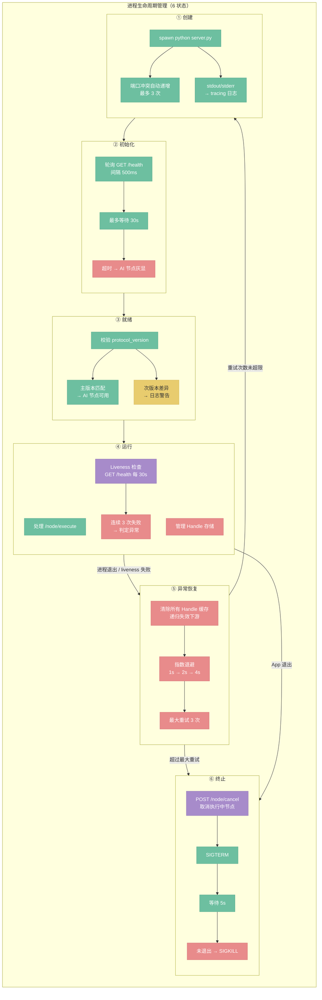
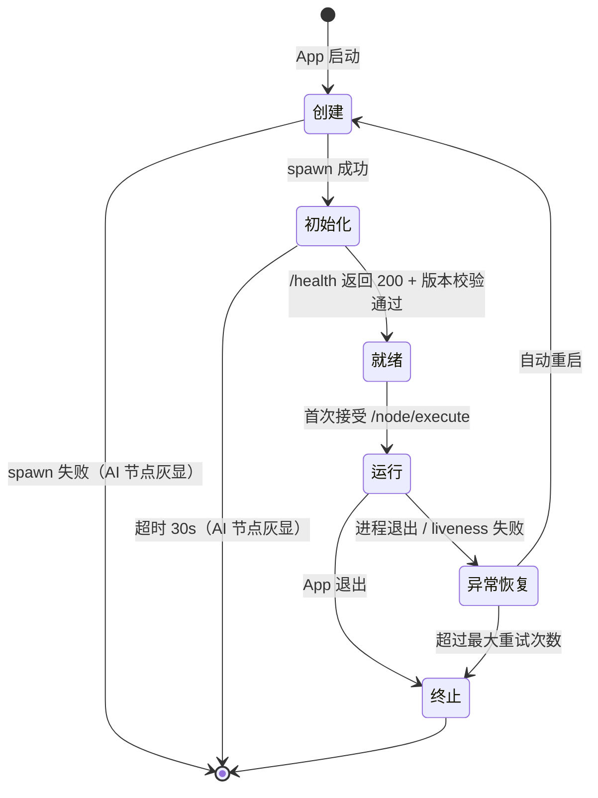

# Python 进程生命周期

> 定位：Python 推理后端的运行时管理——进程 6 状态、超时、并发调度、内部架构。

详见 [50-python-protocol.md](./50-python-protocol.md)（通信协议）
详见 [22-executor-ai.md](./22-executor-ai.md)（Rust 侧 AI 执行器）

## 架构总览



---

## 进程生命周期

Python 后端作为独立进程，生命周期分为 6 个状态，参考 Kubernetes Pod / systemd 的行业标准模型：

```
创建 → 初始化 → 就绪 → 运行 → 异常恢复 → 终止
```



### ① 创建

Rust 侧 spawn Python 子进程，进程尚未可用。

```
读取配置（62-config.md）
  ├─ python_backend_url: 后端地址（默认 http://localhost:8188）
  └─ python_auto_launch: 是否自动启动（默认 true）

若 python_auto_launch = true
  ├─ spawn 子进程：python server.py --port {port} --models-dir {models_dir}
  ├─ stdout/stderr 重定向到 App 日志（tracing）
  └─ 端口冲突时自动递增（最多尝试 3 次）

若 python_auto_launch = false
  └─ 跳过 spawn，假设用户已手动启动后端，直接进入初始化阶段
```

**失败处理：** spawn 失败（Python 未安装、路径错误等）→ AI 节点灰显不可用，图像处理节点正常工作。Python 后端是可选依赖。

### ② 初始化

Python 进程已启动，正在加载 FastAPI 应用、检测 GPU 设备、初始化 Handle 存储。Rust 侧等待其完成。

```
轮询 GET /health（间隔 500ms，最多 30 秒）
  ├─ 尚未响应 → 继续轮询
  ├─ 返回 200 → 进入就绪判定
  └─ 超时 30s → UI 提示，AI 节点灰显不可用
```

### ③ 就绪

`/health` 返回 200，Rust 校验 `protocol_version` 兼容性，通过后 AI 节点变为可用状态。

```
校验 protocol_version
  ├─ 主版本号一致 → AI 节点可用，进入运行状态
  ├─ 次版本号差异 → 日志警告，仍可运行
  └─ 主版本号不匹配 → UI 提示用户更新 Python 端，AI 节点不可用
```

**就绪 ≠ 运行：** 就绪表示"可以接活"，但尚未处理过任何请求。此时模型尚未加载到 VRAM（模型按需加载，由 LoadCheckpoint 节点触发）。

### ④ 运行

正常服务中，持续接受 Rust 侧的 `/node/execute` 调用。Rust 定期通过 liveness 检查确认进程健康。

```
运行期间：
  ├─ 接收并处理 /node/execute 请求
  ├─ 管理 Handle 存储（创建 / 还原 / 释放）
  ├─ 响应 /handles/release（缓存失效驱动）
  │
  └─ Liveness 检查（定期）
       ├─ 方式：GET /health（间隔 30s）
       ├─ 成功 → 继续运行
       ├─ 连续 3 次失败 → 判定为异常，进入异常恢复
       └─ 检测到进程退出 → 立即进入异常恢复
```

**Liveness vs Readiness：**
- Readiness（就绪探针）：启动阶段使用，确认进程可以接受请求
- Liveness（存活探针）：运行阶段使用，确认进程没有卡死或崩溃

### ⑤ 异常恢复

检测到 Python 进程异常（崩溃退出或 liveness 失败），执行状态清理后自动重启。

```
检测到异常
  │
  ├─ ① 状态清理
  │    ├─ 清除 ResultCache 中所有 Handle 类型的条目
  │    ├─ 递归失效这些条目的下游缓存
  │    └─ 重置 BackendClient 连接状态
  │
  ├─ ② 判断是否重启
  │    ├─ 重启次数 < 最大重试次数（默认 3）→ 自动重启（回到创建阶段）
  │    ├─ 两次崩溃间隔 < 10s → 指数退避等待（1s, 2s, 4s）后重启
  │    └─ 超过最大重试次数 → 放弃重启，AI 节点灰显，进入终止状态
  │
  └─ ③ UI 通知
       └─ "AI 后端已重启，需重新执行" 或 "AI 后端多次崩溃，已停止重启"
```

**Python 崩溃后 Rust 无需调用 `/handles/release`：** Python 进程的 VRAM 随进程退出已被操作系统回收，Rust 端只需清除本地 Handle 缓存条目。

### ⑥ 终止

App 退出时优雅关闭 Python 进程。

```
App 退出
  │
  ├─ ① 取消所有正在执行的 AI 节点（POST /node/cancel）
  ├─ ② 发送 SIGTERM
  ├─ ③ 等待 5 秒（Python 清理资源、释放 VRAM）
  └─ ④ 未退出 → SIGKILL 强制终止
```

### 状态总结

| 状态 | Rust 侧行为 | Python 侧状态 | AI 节点可用性 |
|------|------------|--------------|-------------|
| 创建 | spawn 进程 | 进程启动中 | 不可用 |
| 初始化 | 轮询 /health | 加载 FastAPI、检测设备 | 不可用 |
| 就绪 | 校验版本 | 空闲，等待请求 | 可用 |
| 运行 | 发送请求 + liveness 检查 | 处理推理请求 | 可用 |
| 异常恢复 | 清理状态 + 自动重启 | 已退出 | 不可用 |
| 终止 | SIGTERM → SIGKILL | 清理退出 | 不可用 |

---

## 超时机制

Rust 端为每个 `/node/execute` 请求设定超时，按节点类型区分：

| 节点类型 | 默认超时 | 理由 |
|----------|---------|------|
| LoadCheckpoint | 120s | 首次加载大模型需读磁盘 + 初始化 GPU |
| CLIPTextEncode | 30s | 文本编码，计算量小 |
| EmptyLatentImage | 10s | 纯内存分配 |
| KSampler | 600s | 高步数 + 高分辨率可能很慢 |
| VAEDecode | 60s | 单次 GPU 计算，大图较慢 |

**收到 `progress` 事件会重置超时计时器。** KSampler 跑 100 步可能要很久，但只要每步都有 progress 推送，就不会触发超时。超时只在 Python 端完全无响应时才生效。

超时触发后，Rust 调用 `POST /node/cancel/{execution_id}` 尝试取消，并向 UI 报告超时错误。

---

## 并发模型

### Rust 端

EvalEngine 拓扑排序后，同层无依赖的 AI 节点通过 rayon 并发发送 `/node/execute` 请求（与 `60-concurrency.md` 的同层并行规则一致）。

示例——SDXL 典型图：

```
LoadCheckpoint ──→ CLIPTextEncode(正面) ──→ KSampler
                └→ CLIPTextEncode(反面) ──↗
                                          EmptyLatentImage ──↗
```

执行顺序：
1. LoadCheckpoint（串行）
2. CLIPTextEncode(正面) + CLIPTextEncode(反面) + EmptyLatentImage（**并发**，三个请求同时发出）
3. KSampler（等步骤 2 全部完成）
4. VAEDecode

### Python 端

并发请求进入执行队列后，由调度器决定执行策略：

- 轻量节点（CLIPTextEncode、EmptyLatentImage）：可并行执行，GPU 未打满
- 重型节点（KSampler）：独占 GPU，队列中其他请求等待其完成

调度策略是 Python 内部实现细节，协议层不规定具体算法。

---

## Python 端内部架构

```
python/
├── server.py          # FastAPI 应用，路由定义
├── executor.py        # 执行队列调度
├── handle_store.py    # Handle 存储管理
├── device.py          # GPU 设备检测
└── nodes/             # 节点执行函数
    ├── __init__.py
    ├── load_checkpoint.py
    ├── clip_text_encode.py
    ├── empty_latent_image.py
    ├── ksampler.py
    └── vae_decode.py
```

### 各模块职责

**server.py** — HTTP 层，只做路由和序列化，不含业务逻辑：
- 接收 `/node/execute`，解析 multipart，交给 executor
- 接收 `/node/cancel`，转发给 executor
- 接收 `/handles/release`，转发给 handle_store
- `/health` 聚合 device 和 handle_store 信息返回

**executor.py** — 执行调度核心：
- 维护执行队列，分配 `execution_id`
- 根据 GPU 负载决定并行或排队
- 调用 handle_store 还原输入 Handle 为真实 GPU 对象
- 调用 nodes/ 中的执行函数
- 将输出中的 Python 专属类型存入 handle_store
- 管理取消标志位，迭代节点每步检查

**handle_store.py** — Handle 生命周期管理：
- `store(obj, node_type, output_pin) → handle_id`：存入 GPU 对象，生成 ID
- `resolve(handle_id) → obj`：还原为真实对象，不存在则抛出 handle_error
- `release(ids)`：释放指定 Handle，`del` 对象 + `gc.collect()` + `torch.cuda.empty_cache()`
- `list_all() → [HandleInfo]`：返回所有 Handle 及 VRAM 占用估算

**device.py** — 设备检测：
- CUDA / MPS / CPU 检测
- float16 / float32 选择
- VRAM 总量和剩余查询

**nodes/*.py** — 纯执行函数，每个文件一个节点：
- 输入：已还原的 GPU 对象 + 标量参数
- 输出：GPU 对象（由 executor 存入 handle_store）或 Image bytes
- 迭代节点接收 `progress_callback` 和 `cancel_flag` 参数

## 设计决策

- **D26**: 协议版本校验（主版本匹配即可运行）
- **D30**: 超时按节点类型差异化，progress 重置计时器
