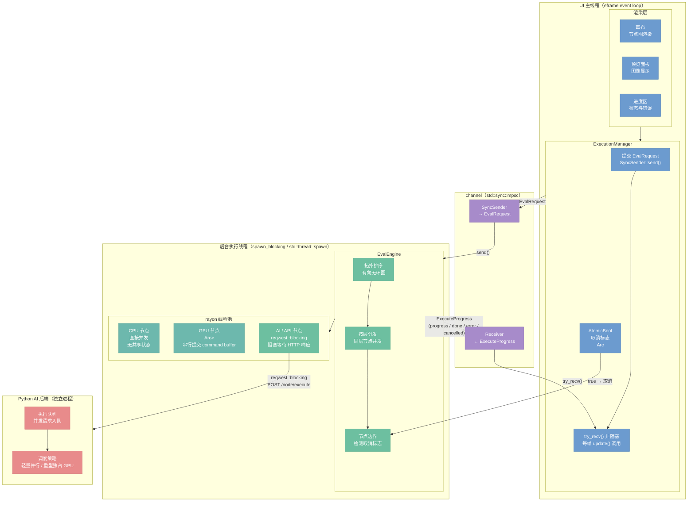
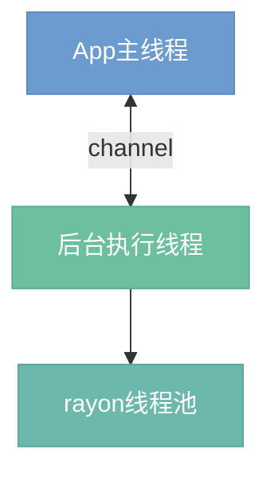

# 并发模型

> 定位：系统的线程模型、并行策略、前端异步交互方式。

## 架构总览

## 总览（简化版）

## 1. 执行模型（决策 D06）

后台执行线程负责编排整个求值流程，rayon 线程池负责同层节点的并行执行。

**架构选择：** 独立后台线程 + rayon 并行，不引入 async/await。

**理由：**

- 图求值属于 CPU / GPU 密集型工作负载，线程池模型与此天然匹配。
- async 运行时（Tokio 等）为 I/O 并发而设计，引入后会带来不必要的复杂度，且与 rayon 的 work-stealing 调度存在集成摩擦。
- rayon 的 `par_iter` / `join` 原语简洁直接，能够自动适配可用 CPU 核心数。

**同层并行规则：** 拓扑排序后，同一"层"（所有依赖均已完成）的节点通过 rayon 并发执行；跨层依然保持顺序。

## 2. 各类节点并行行为

### GPU 节点

GPU 命令提交通过 `Arc<Mutex<GpuContext>>` 串行化。每次提交前先加锁，录制 command buffer，提交至 queue 后释放锁。

- 串行提交是软件层面的约束，GPU 硬件本身可在驱动层进行流水线叠加（pipeline overlap）。
- 避免多线程同时写入同一 wgpu queue 引发未定义行为。

### CPU 节点

无需额外同步。rayon 直接将同层 CPU 节点分发到不同线程执行，各节点操作独立的输入/输出 `Value`，无共享可变状态。

### AI / API 节点（决策 D07）

使用 `reqwest::blocking` 发出 HTTP 请求，在后台执行线程内阻塞等待响应。

- AI 节点数量通常远少于 GPU / CPU 节点，阻塞开销可接受。
- 保持与其他节点一致的同步执行模型，无需在图求值引擎中引入 Future。
- 同层无依赖的 AI 节点通过 rayon 并发发起请求，Python 端维护执行队列，根据 GPU 负载决定并行或排队执行。详见 [`50-python-protocol.md`](50-python-protocol.md)。

## 3. 前端不阻塞策略（决策 D23）

前端 UI 运行在 egui 的主线程（`eframe` event loop），必须保持每帧响应，不得阻塞。

**三项机制：**

| 机制 | 类型 | 作用 |
|------|------|------|
| `std::sync::mpsc` channel | `SyncSender` / `Receiver` | 前端提交求值请求；后台回传 `ExecuteProgress` |
| `ExecuteProgress` | enum（跨线程） | 携带进度百分比、节点完成通知、最终结果或错误 |
| `AtomicBool` 取消标志 | `Arc<AtomicBool>` | 前端置 `true` 后，后台执行线程在节点边界检测并提前退出 |

**交互流程：**

1. 用户触发求值 → 前端通过 channel 发送 `EvalRequest`，立即返回。
2. 后台执行线程收到请求，开始图求值，每完成一个节点发送一条 `ExecuteProgress`。
3. 前端在 `update()` 帧回调中非阻塞地 `try_recv` 所有待读事件，更新进度条与预览。
4. 用户点击"取消" → 前端将 `AtomicBool` 置为 `true`；后台在下一个节点开始前检测到标志，终止求值并发送 `ExecuteProgress::Cancelled`。

---

**相关文档：**
- [`41-app-execution.md`](41-app-execution.md) — App 执行管理器详细设计
- [`50-python-protocol.md`](50-python-protocol.md) — Python 后端协议与进程生命周期
