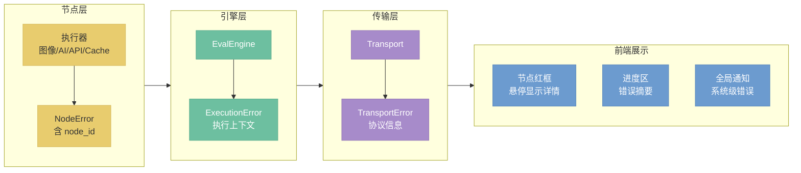

# 错误处理

> 定位：分层 Error 类型、传播路径、前端展示策略。

## 架构总览

```mermaid
flowchart TB
    classDef frontend    fill:#6C9BCF,stroke:#5A89BD,color:#fff
    classDef transport   fill:#A78BCA,stroke:#9579B8,color:#fff
    classDef service     fill:#6DBFA0,stroke:#5BAD8E,color:#fff
    classDef ai          fill:#E88B8B,stroke:#D67979,color:#fff
    classDef api         fill:#E8A87C,stroke:#D6966A,color:#fff
    classDef foundation  fill:#E8CC6E,stroke:#D6BA5C,color:#333
    classDef compute     fill:#6DB8AD,stroke:#5BA69B,color:#fff
    classDef future      fill:#B0B8C1,stroke:#9EA6AF,color:#fff,stroke-dasharray:5 5

    subgraph NODE_LAYER["节点层（nodeimg-engine）"]
        direction TB

        subgraph NL_EXECUTORS["执行器"]
            direction LR
            NL_GPU["GPU 执行器\nshader 编译 / dispatch"]:::compute
            NL_CPU["CPU 执行器\n文件 I/O / LUT"]:::foundation
            NL_AI["AI 执行器\nPython 推理 / CUDA OOM"]:::ai
            NL_API["API 执行器\n云端 API / 认证 / 限流"]:::api
        end

        subgraph NL_ERROR["NodeError（thiserror）"]
            direction LR
            NE_SHADER["ShaderFailed(String)"]:::foundation
            NE_VRAM["VramExhausted\n{ required, available }"]:::foundation
            NE_IO["IoError(std::io::Error)"]:::foundation
            NE_INFER["InferenceFailed(String)"]:::foundation
        end

        NL_EXECUTORS -->|"产生"| NL_ERROR
    end

    subgraph ENGINE_LAYER["引擎层（EvalEngine）"]
        direction TB

        subgraph EL_ENGINE["EvalEngine"]
            direction LR
            EL_TOPO["拓扑排序\n环路检测"]:::service
            EL_SCHED["调度分发\n依赖解析"]:::service
        end

        subgraph EL_ERROR["ExecutionError（thiserror）"]
            direction LR
            EE_NODE["NodeFailed\n{ node_id, source: NodeError }"]:::service
            EE_CYCLE["CycleDetected"]:::service
            EE_DEP["DependencyMissing"]:::service
        end

        EL_ENGINE -->|"包装 NodeError\n#[from]"| EL_ERROR
    end

    subgraph TRANSPORT_LAYER["传输层（Transport trait）"]
        direction TB

        subgraph TL_TRANSPORT["Transport 实现"]
            direction LR
            TL_LOCAL["LocalTransport"]:::transport
            TL_HTTP["HttpTransport"]:::transport
        end

        subgraph TL_ERROR["TransportError（thiserror）"]
            direction LR
            TE_CONN["ConnectionFailed(String)"]:::transport
            TE_PROTO["ProtocolMismatch\n{ expected, actual }"]:::transport
            TE_EXEC["Execution(#[from] ExecutionError)"]:::transport
        end

        TL_TRANSPORT -->|"包装 ExecutionError\n#[from]"| TL_ERROR
    end

    subgraph DISPLAY_LAYER["前端展示（App UI）"]
        direction TB

        subgraph DL_NODE["节点红框"]
            direction TB
            DN_HIGHLIGHT["高亮对应节点边框\n有效 node_id"]:::frontend
            DN_TOOLTIP["悬停显示错误详情"]:::frontend
            DN_HIGHLIGHT --> DN_TOOLTIP
        end

        subgraph DL_PROGRESS["进度区"]
            direction TB
            DP_SUMMARY["执行进度条区域\n错误摘要\n始终可见"]:::frontend
        end

        subgraph DL_GLOBAL["全局通知"]
            direction TB
            DG_TOAST["屏幕角落弹出\n系统级 / 无关联节点\nTransportError"]:::frontend
        end
    end

    NODE_LAYER -->|"NodeError → ExecutionError\n#[from] 自动转换"| ENGINE_LAYER
    ENGINE_LAYER -->|"ExecutionError → TransportError\n#[from] 自动转换"| TRANSPORT_LAYER
    TRANSPORT_LAYER -->|"TransportError\n通过 ExecuteProgress::Error 传递"| DISPLAY_LAYER
```



## 总览（简化版）



## 1. 分层 Error enum（决策 D01）

错误类型按职责边界分为三层，各层通过 `thiserror` 派生，保持独立演进能力。

| 层级 | 类型 | 携带信息 | 职责 |
|------|------|----------|------|
| 节点层 | `NodeError` | `node_id`、错误原因 | 描述单个节点执行失败的具体原因 |
| 引擎层 | `ExecutionError` | 执行上下文（图 ID、执行批次） | 包装 `NodeError`，补充图级调度信息 |
| 传输层 | `TransportError` | 协议信息（连接地址、状态码） | 包装 `ExecutionError`，补充网络/协议层信息 |

**决策 D01 — 为何分三层而非单一 Error 枚举：**
单一枚举在节点层变更时会破坏传输层接口，反之亦然。三层设计使每层可独立扩展枚举变体，跨层依赖通过 `#[from]` 自动转换，不需要手写 `From` 实现。

```rust
// 示意（非完整代码）
#[derive(Debug, thiserror::Error)]
pub enum NodeError {
    #[error("shader 执行失败: {0}")]
    ShaderFailed(String),
    #[error("VRAM 耗尽: 需要 {required} bytes，可用 {available} bytes")]
    VramExhausted { required: usize, available: usize },
    // ...
}

#[derive(Debug, thiserror::Error)]
pub enum ExecutionError {
    #[error("节点 {node_id} 执行失败: {source}")]
    NodeFailed { node_id: NodeId, #[source] source: NodeError },
    #[error("图中存在环路，无法拓扑排序")]
    CycleDetected,
    // ...
}

#[derive(Debug, thiserror::Error)]
pub enum TransportError {
    #[error("连接失败: {0}")]
    ConnectionFailed(String),
    #[error("执行失败: {0}")]
    Execution(#[from] ExecutionError),
    // ...
}
```

## 2. 错误产生位置

| 产生位置 | 错误类型 | 典型错误示例 |
|----------|----------|-------------|
| 图像执行器 | `NodeError` | shader 编译失败、纹理格式不匹配、WGSL dispatch 超时 |
| AI 执行器 | `NodeError` | CUDA OOM、模型未加载、推理超时 |
| API 执行器 | `NodeError` | 认证失败（401）、限流（429）、响应解析错误 |
| EvalEngine | `ExecutionError` | 图中存在环路、节点依赖缺失、拓扑排序失败 |
| Transport | `TransportError` | 连接失败、协议版本不兼容、序列化错误 |
| Cache | `NodeError` | VRAM 耗尽、缓存键冲突、GPU 资源释放失败 |

## 3. 前端展示（决策 D02）

前端采用**多位置同时展示**策略：不同展示位置面向不同粒度的错误，互不排斥，各层独立补充。

| 展示位置 | 触发条件 | 展示内容 |
|----------|----------|----------|
| 节点红框 | `NodeError` 含有效 `node_id` | 在画布上高亮对应节点边框，悬停显示错误详情 |
| 进度区 | 任何错误（`NodeError` / `ExecutionError` / `TransportError`） | 在执行进度条区域显示错误摘要，始终可见 |
| 全局通知 | `TransportError` 等系统级错误（无关联节点） | 屏幕角落弹出通知，提示连接或系统异常 |

**决策 D02 — 为何不互斥：**
节点红框只能覆盖"已知是哪个节点出错"的场景；进度区覆盖所有执行失败；全局通知覆盖与节点无关的基础设施错误。三者叠加能确保任意错误路径都有可见反馈，避免静默失败。

---

**相关文档：**
- [`20-engine.md`](20-engine.md) — EvalEngine 详细设计
- [`30-transport.md`](30-transport.md) — Transport trait 与实现
- [`60-concurrency.md`](60-concurrency.md) — 并发模型与 ExecuteProgress 传递
