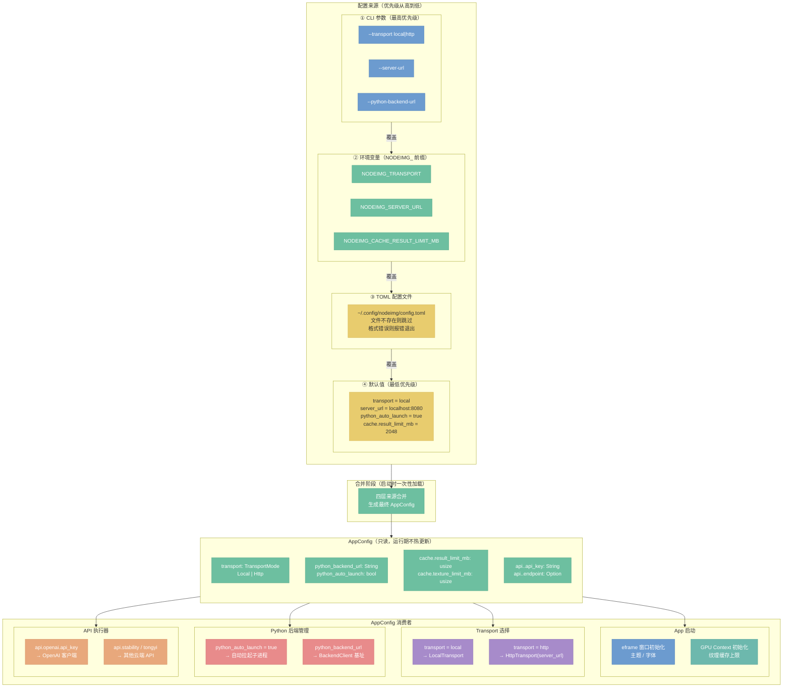
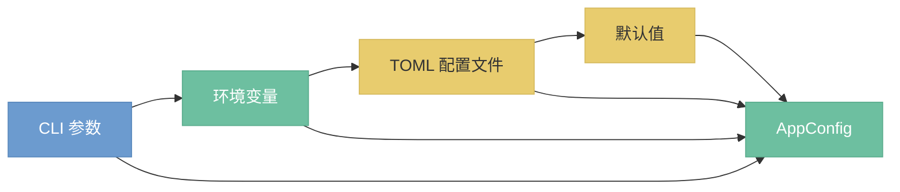

# 配置系统

> 定位：配置源、配置项清单、加载时机。

## 架构总览



## 总览（简化版）



逐层覆盖合并：CLI 参数覆盖环境变量，环境变量覆盖配置文件，配置文件覆盖默认值，最终合并为统一的 `AppConfig` 结构。

## 配置源优先级（决策 D08）

优先级从高到低：

1. **CLI 参数** — 运行时通过命令行传入，优先级最高，适用于临时覆盖
2. **环境变量** — 以 `NODEIMG_` 为前缀，适用于容器/CI 环境注入
3. **TOML 配置文件** — 持久化的用户偏好，适用于本地开发环境
4. **默认值** — 代码内置，保证零配置可运行

决策依据：遵循 12-Factor App 的配置优先级惯例，使配置来源清晰可预期，便于在不同环境（开发/测试/生产）间切换而无需修改代码。

## 配置文件

路径：`~/.config/nodeimg/config.toml`

若文件不存在则跳过，全部使用默认值。

```toml
transport = "local"
server_url = "http://localhost:8080"
python_backend_url = "http://localhost:8188"
python_auto_launch = true

[cache]
result_limit_mb = 2048
texture_limit_mb = 512

[api.openai]
api_key = ""
# endpoint = "https://api.openai.com/v1"  # 可选覆盖

[api.stability]
api_key = ""

[api.tongyi]
api_key = ""
```

## 配置项清单

| 配置项 | 环境变量 | 默认值 | 说明 |
|---|---|---|---|
| `transport` | `NODEIMG_TRANSPORT` | `"local"` | 传输模式，可选 `local` / `http` |
| `server_url` | `NODEIMG_SERVER_URL` | `"http://localhost:8080"` | HTTP 传输模式下的服务端地址 |
| `python_backend_url` | `NODEIMG_PYTHON_BACKEND_URL` | `"http://localhost:8188"` | Python AI 后端地址 |
| `python_auto_launch` | `NODEIMG_PYTHON_AUTO_LAUNCH` | `true` | 启动时是否自动拉起 Python 后端进程 |
| `cache.result_limit_mb` | `NODEIMG_CACHE_RESULT_LIMIT_MB` | `2048` | 节点计算结果缓存上限（MB） |
| `cache.texture_limit_mb` | `NODEIMG_CACHE_TEXTURE_LIMIT_MB` | `512` | GPU 纹理缓存上限（MB） |
| `api.<provider>.api_key` | `NODEIMG_API_<PROVIDER>_API_KEY` | `""` | 云端 API 厂商密钥（openai / stability / tongyi） |
| `api.<provider>.endpoint` | `NODEIMG_API_<PROVIDER>_ENDPOINT` | 各厂商官方地址 | 可选覆盖 API 端点（用于代理或私有部署） |

## 加载时机（决策 D09）

配置在**应用启动时一次性加载**，运行期间不热更新。

加载流程：

1. 解析 CLI 参数，构建参数覆盖层
2. 读取环境变量，构建环境变量覆盖层
3. 尝试读取 `~/.config/nodeimg/config.toml`，若文件缺失则跳过，若格式错误则报错退出
4. 合并四层来源，生成最终的 `AppConfig`，注入全局状态

决策依据：图像处理应用的配置（GPU 缓存上限、后端地址）在初始化阶段即需确定，中途变更会使已分配资源的状态不一致。不热更新可简化实现，同时避免运行时竞���。如需变更配置，重启应用即可生效。

---

**相关文档：**
- [`30-transport.md`](30-transport.md) — Transport 选择与 HttpTransport 配置
- [`50-python-protocol.md`](50-python-protocol.md) — Python 后端地址与自动拉起
- [`40-app-overview.md`](40-app-overview.md) — App 启动流程与配置注入
