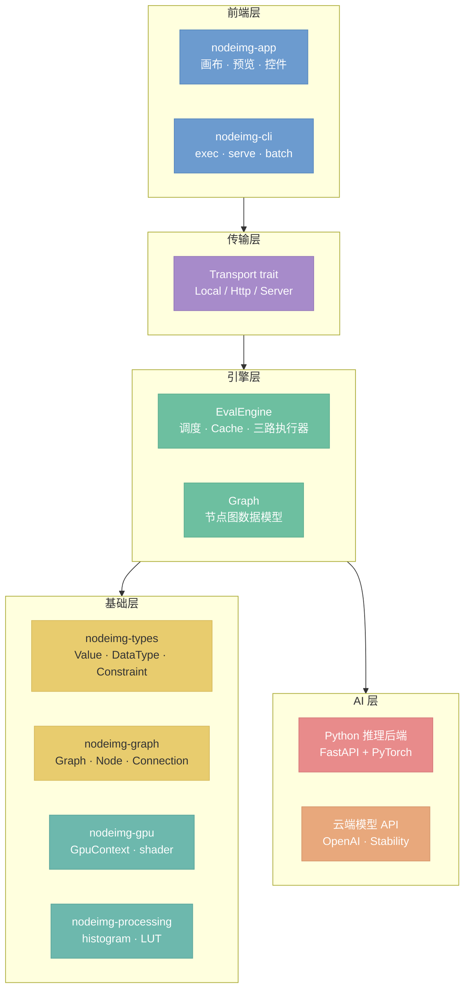

# nodeimg 目标架构 v2

> 本目录是 nodeimg 目标架构的文档体系 v2。按子模块拆分，一个文档一个概念单元。目标架构描述系统**应当成为的样子**，是设计决策的集中记录，也是重构和新功能开发的参考基准。

---

## 总架构图

**核心原则：Engine 始终本地运行，Graph 由 Engine 拥有。** App 通过命令接口操作 Engine；远端能力仅限 AI 推理和云端 API。



---

## Crate → 文档映射

| Crate | 主文档 | 相关文档 |
|-------|--------|---------|
| nodeimg-types | [10-types.md](./10-types.md) | — |
| nodeimg-graph | [11-graph.md](./11-graph.md) | [10-types.md](./10-types.md) |
| nodeimg-engine | [20-engine.md](./20-engine.md) | [21](./21-executor-image.md)/[22](./22-executor-ai.md)/[23](./23-executor-api.md), [24-node-framework.md](./24-node-framework.md) |
| nodeimg-gpu | — | [21-executor-image.md](./21-executor-image.md), [24-node-framework.md](./24-node-framework.md) |
| nodeimg-processing | — | [21-executor-image.md](./21-executor-image.md) |
| nodeimg-server | [30-transport.md](./30-transport.md) | — |
| nodeimg-app | [40-app-overview.md](./40-app-overview.md) | [41](./41-app-execution.md)/[42](./42-app-editor.md)/[43](./43-app-theme.md) |
| nodeimg-cli | [44-cli.md](./44-cli.md) | — |
| Python 后端 | [50-python-protocol.md](./50-python-protocol.md) | [51-python-lifecycle.md](./51-python-lifecycle.md) |

---

## 关键架构约束

| 约束 | 说明 | 文档 |
|------|------|------|
| Engine 始终本地 | App 与 Engine 同进程直调，不经网络 | [01](./01-overview.md), [20](./20-engine.md) |
| Graph 归 Engine | App 通过命令操作图，不直接持有 Graph | [11](./11-graph.md), [40](./40-app-overview.md) |
| GPU+CPU 协作 | GPU 做像素运算，CPU 做 I/O 和分析，Image 节点 200ms 防抖自动执行 | [21](./21-executor-image.md), [41](./41-app-execution.md) |
| AI 用户可控 | AI/API 节点 Ctrl+Enter 手动触发，旧结果保留 | [22](./22-executor-ai.md), [41](./41-app-execution.md) |
| 远端仅限推理 | Python 和云端 API 可远端，图像处理始终本地 | [22](./22-executor-ai.md), [23](./23-executor-api.md), [50](./50-python-protocol.md) |
| Handle 豁免 LRU | Handle 不被淘汰，释放由失效或 VRAM 不足驱动 | [20](./20-engine.md), [50](./50-python-protocol.md) |
| 节点内聚 | 一节点 = 一文件夹（mod.rs + shader + cpu） | [24](./24-node-framework.md) |
| 声明式注册 | node! 宏 + inventory，新增节点不改聚合文件 | [24](./24-node-framework.md) |
| 逻辑/渲染分离 | 逻辑层不引用 egui，换框架只重写渲染层 | [40](./40-app-overview.md) |

---

## 文档索引

| 编号 | 文件 | 主题 |
|------|------|------|
| 00 | [00-context.md](./00-context.md) | 系统上下文与边界 |
| 01 | [01-overview.md](./01-overview.md) | 调用链总览 + crate 依赖图 |
| 10 | [10-types.md](./10-types.md) | 数据类型体系 + Handle 边界 |
| 11 | [11-graph.md](./11-graph.md) | 节点图数据模型 + 操作 API |
| 20 | [20-engine.md](./20-engine.md) | EvalEngine 调度 + Cache + 混合图示例 |
| 21 | [21-executor-image.md](./21-executor-image.md) | 图像处理执行器（GPU + CPU 协作）|
| 22 | [22-executor-ai.md](./22-executor-ai.md) | AI 执行器（HTTP → Python）|
| 23 | [23-executor-api.md](./23-executor-api.md) | 模型 API 执行器（云端 API）|
| 24 | [24-node-framework.md](./24-node-framework.md) | node! 宏 + 文件夹约定 + inventory |
| 30 | [30-transport.md](./30-transport.md) | Transport trait + Local/Http/Server |
| 40 | [40-app-overview.md](./40-app-overview.md) | App 架构 + 启动关闭 + 逻辑渲染分离 |
| 41 | [41-app-execution.md](./41-app-execution.md) | ExecutionManager + 自动执行 + 预览 |
| 42 | [42-app-editor.md](./42-app-editor.md) | Tab + Undo + 搜索 + 快捷键 + Widget |
| 43 | [43-app-theme.md](./43-app-theme.md) | 主题系统 |
| 44 | [44-cli.md](./44-cli.md) | nodeimg-cli exec/serve/batch |
| 50 | [50-python-protocol.md](./50-python-protocol.md) | Python 协议 + Handle + VRAM |
| 51 | [51-python-lifecycle.md](./51-python-lifecycle.md) | 进程生命周期 + 超时 + 并发 |
| 60 | [60-concurrency.md](./60-concurrency.md) | 线程模型与并行策略 |
| 61 | [61-error-handling.md](./61-error-handling.md) | 分层 Error 类型 |
| 62 | [62-config.md](./62-config.md) | 配置系统 |
| 63 | [63-cross-cutting.md](./63-cross-cutting.md) | 安全/观测/测试/性能/部署/版本 |
| 70 | [70-decisions.md](./70-decisions.md) | 设计决策索引 D01-D36 |
| 71 | [71-risks.md](./71-risks.md) | 风险与技术债 TD01-TD07 |
| 72 | [72-glossary.md](./72-glossary.md) | 术语表 |
| 73 | [73-node-catalog.md](./73-node-catalog.md) | 节点目录 ~86 节点 |

编号区间：0x=全局、1x=基础层、2x=引擎层、3x=传输层、4x=前端层、5x=AI层、6x=横切、7x=附录

---

## Mermaid 配色规范

全局语义化 classDef，**所有文件统一使用**，不得自行引入其他颜色：

```
classDef frontend    fill:#6C9BCF,stroke:#5A89BD,color:#fff
classDef transport   fill:#A78BCA,stroke:#9579B8,color:#fff
classDef service     fill:#6DBFA0,stroke:#5BAD8E,color:#fff
classDef ai          fill:#E88B8B,stroke:#D67979,color:#fff
classDef api         fill:#E8A87C,stroke:#D6966A,color:#fff
classDef foundation  fill:#E8CC6E,stroke:#D6BA5C,color:#333
classDef compute     fill:#6DB8AD,stroke:#5BA69B,color:#fff
classDef future      fill:#B0B8C1,stroke:#9EA6AF,color:#fff,stroke-dasharray:5 5
```

### 语义映射

| classDef | 用于 | 色调 |
|----------|------|------|
| `frontend` | GUI、CLI、App 层组件 | 柔蓝 |
| `transport` | Transport trait、协议层、HttpTransport | 淡紫 |
| `service` | EvalEngine、Registry、Cache、服务层组件 | 薄荷绿 |
| `ai` | AI 执行器、Python 后端、SDXL 相关 | 柔红 |
| `api` | 模型 API 执行器、云端 provider | 柔橙 |
| `foundation` | nodeimg-types、nodeimg-graph、基础数据结构 | 柔黄 |
| `compute` | nodeimg-gpu、GpuContext、shader、pipeline | 青绿 |
| `future` | 远期功能、未实现部分 | 灰色虚线 |

### 图表规则

- 只用 hex 颜色，不用颜色名
- 用 classDef 语义类名，不在节点上内联 `style`
- 每张图配简短文字说明，不依赖图自解释
- flowchart 方向：系统层级用 `TB`（上到下），时序流程用 `LR`（左到右）
