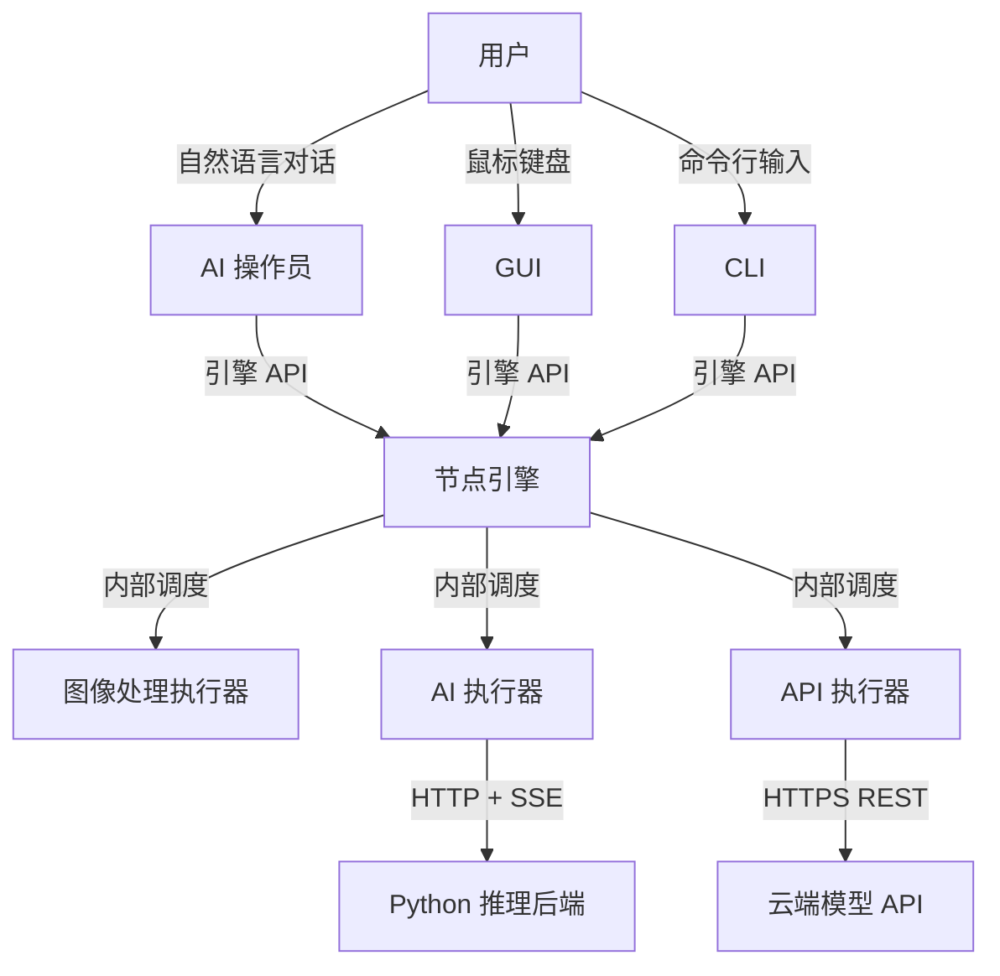

# 整体架构

> nodeimg 系统的顶层参与者和入口。

## 总览

```mermaid
flowchart TB
    User["用户"]
    AIOperator["AI 操作员"]

    User -->|"自然语言对话"| AIOperator
    User -->|"鼠标键盘"| GUI["GUI"]
    User -->|"命令行输入"| CLI["CLI"]

    AIOperator -->|"引擎 API"| Engine["节点引擎"]
    GUI -->|"引擎 API"| Engine
    CLI -->|"引擎 API"| Engine

    Engine -->|"内部调度"| ImageExec["图像处理执行器"]
    Engine -->|"内部调度"| AIExec["AI 执行器"]
    Engine -->|"内部调度"| APIExec["API 执行器"]

    AIExec -->|"HTTP + SSE"| Python["Python 推理后端"]
    APIExec -->|"HTTPS REST"| Cloud["云端模型 API"]
```
