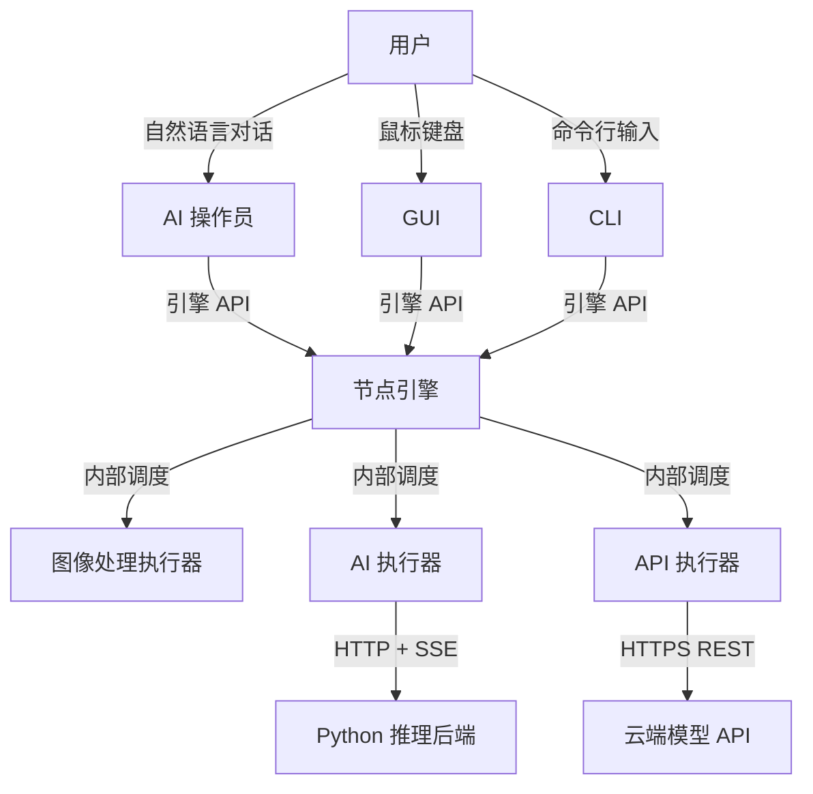

# 整体架构

> nodeimg 系统的顶层参与者、模块和交互方式。

## 总览

---

## 参与者

- **用户**：通过 GUI、CLI 或 AI 操作员使用系统。
- **AI 操作员**：GUI 内嵌的对话助手，接收用户自然语言指令，直接调用引擎 API 操作。

## 模块

- **GUI**：图形界面前端，画布编辑节点图、预览结果，内含 AI 对话面板。
- **CLI**：命令行前端，执行节点图、批量处理。
- **节点引擎**：系统核心，始终本地运行，管理节点图、拓扑排序、分发执行、缓存结果。
- **图像处理执行器**：本地 GPU/CPU 执行像素运算和文件 I/O。
- **AI 执行器**：调用 Python 推理后端执行 AI 节点。
- **API 执行器**：调用云端模型 API 执行推理。
- **Python 推理后端**：独立进程，FastAPI + PyTorch，执行模型推理。
- **云端模型 API**：第三方云服务（OpenAI、Stability AI 等）。

## 交互方式

| 连接 | 方式 | 说明 |
|------|------|------|
| 用户 → AI 操作员 | 自然语言对话 | GUI 内对话面板 |
| 用户 → GUI | 鼠标键盘 | 拖拽、连线、调参 |
| 用户 → CLI | 命令行输入 | exec / serve / batch |
| AI 操作员 → 引擎 | 引擎 API | 直接调用，GUI 自动刷新 |
| GUI → 引擎 | 引擎 API | 同进程函数调用 |
| CLI → 引擎 | 引擎 API | 同进程函数调用 |
| 引擎 → 执行器 | 内部调度 | 按节点类型分发 |
| AI 执行器 → Python | HTTP + SSE | 流式回传进度 |
| API 执行器 → 云端 | HTTPS REST | 无状态调用 |
