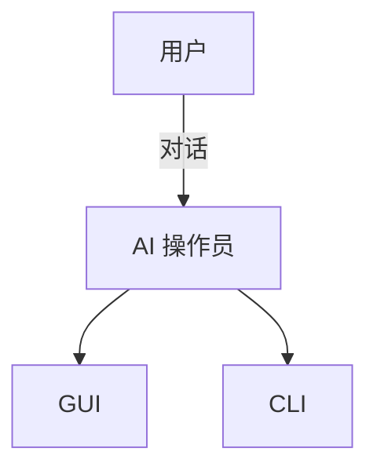

# AI 操作员

> 用户通过对话驱动 AI 操作员，AI 操作员代替用户操作 GUI 或 CLI。

## 总览

```mermaid
flowchart TB
    User["用户"]
    AIOperator["AI 操作员"]

    User -->|"对话"| AIOperator
    AIOperator --> GUI["GUI"]
    AIOperator --> CLI["CLI"]
```
