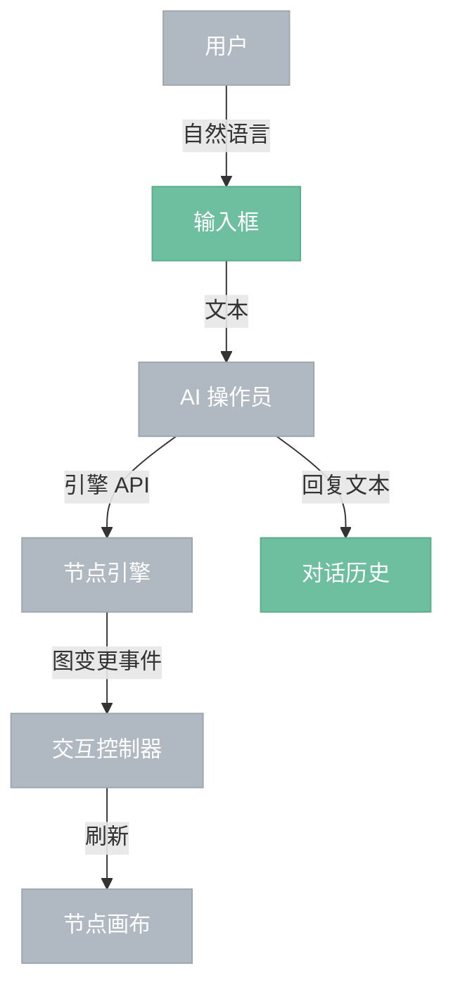

# AI 对话面板

> 内嵌的 AI 操作员对话界面。用户输入自然语言指令，面板将其转发给 AI 操作员，AI 操作员通过引擎 API 执行操作，GUI 通过事件感知变更自动刷新。

## 界面结构

```
┌─────────────────────────┐
│  对话历史（滚动）         │
│                          │
│  [AI]  已添加亮度节点     │
│  [用户] 再连接到输出      │
│  [AI]  已完成连接         │
│                          │
├─────────────────────────┤
│  输入框        [发送]    │
└─────────────────────────┘
```

## 交互流程



## 说明

- AI 对话面板与交互控制器**无直接连接**——指令直接转发给 AI 操作员，不经过控制器。
- 画布刷新由引擎事件驱动，经由交互控制器，与对话面板无关。
- AI 操作员执行期间输入框禁用，完成后恢复。
- 对话历史仅在本次会话内保留，不持久化。
