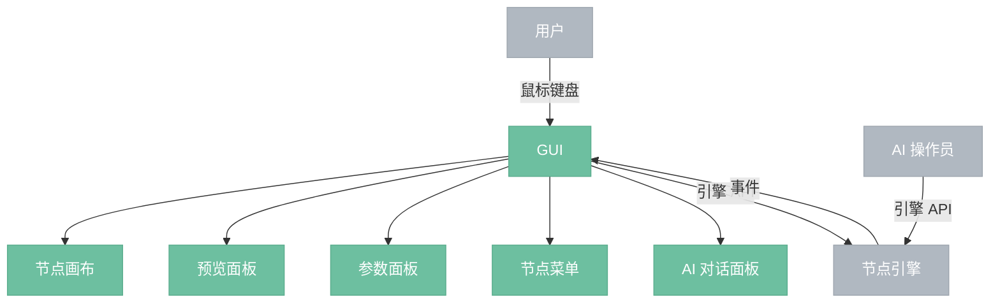

# GUI

> 图形界面前端，画布编辑节点图、预览结果，内含 AI 对话面板。

## 总览

---

## 组件

- **节点画布**：节点图的可视化编辑区。节点拖拽、连线绘制、框选、缩放平移。读取引擎的图快照渲染，用户操作转换为引擎 API 调用。
- **预览面板**：显示选中节点的输出预览（图像、直方图等）。从纹理缓存按需获取 GpuTexture 渲染。
- **参数面板**：显示选中节点的参数控件。控件类型由参数的数据类型和约束自动决定（滑块、下拉框、颜色选择器等），参数修改通过引擎 API 提交。
- **节点菜单**：节点创建入口。按分类展示所有可用节点，支持搜索。从节点管理器查询分类和节点列表。
- **AI 对话面板**：内嵌的 AI 操作员对话界面。用户输入自然语言指令，AI 操作员通过引擎 API 执行操作。

---

## 交互方式

| 交互 | 说明 |
|------|------|
| GUI → 引擎 | 同进程函数调用，用户操作转换为引擎 API 调用 |
| 引擎 → GUI | 事件系统推送，GUI 每帧轮询消费（执行进度、图变更等） |
| 用户 → AI 对话 | 自然语言输入，AI 操作员处理后调用引擎 API |

GUI 不直接修改引擎状态，所有变更通过引擎 API 提交。引擎状态变化通过事件系统通知 GUI 刷新。

---

## 技术栈

- **eframe / egui**：即时模式 GUI 框架
- **wgpu**：共享 eframe 的 GPU 后端，用于预览纹理渲染

---

## 边界情况

- **大图性能**：节点数量多时画布渲染优化——视口外节点跳过绘制，连线简化。
- **执行中交互**：执行期间用户可继续编辑。引擎基于不可变状态快照执行，编辑产生新版本不影响当前执行。
- **GPU 不可用**：预览面板降级为 CPU 软渲染。
