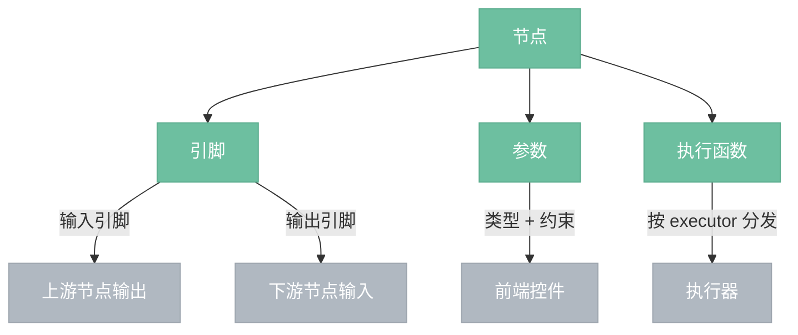

# 节点

> 节点是图中的最小处理单元，接收输入、执行处理、产出输出。本文档描述节点的概念模型和开发框架。

## 概念模型



---

## 节点组成

| 组成 | 说明 |
|------|------|
| 名称/标题/分类 | 节点的标识和归类 |
| 输入引脚 | 0~N 个，接收上游数据，有数据类型，可标记为必需 |
| 输出引脚 | 0~N 个，传递给下游，有数据类型 |
| 参数 | 0~N 个，用户可调值，有数据类型 + 约束 + 默认值 |
| 执行函数 | 节点的处理逻辑，按 executor 类型分发到不同执行器 |

---

## 数据类型

| 类型 | 含义 |
|------|------|
| Image | RGBA 图像 |
| Mask | 单通道灰度图 |
| Float | 浮点数 |
| Int | 整数 |
| Color | RGBA 颜色值 |
| Boolean | 布尔值 |
| String | 文本字符串 |
| Model / Clip / Vae / Conditioning / Latent | AI 节点专属类型，数据留在 Python 端，Rust 侧只持有 Handle |

---

## 执行器类型

| executor | 说明 | 分发目标 | 触发方式 |
|----------|------|----------|---------|
| Image（缺省） | 图像处理节点 | 图像处理执行器 | 自动 + 手动 |
| AI | 自部署 AI 节点 | AI 执行器 → Python 后端 | 仅手动触发 |
| API | 云端模型节点 | API 执行器 → 云端 API | 仅手动触发 |

---

## 节点开发框架

图像/API 节点在 Rust 侧定义，AI 节点在 Python 侧定义。Rust 编译时自动收集两端的节点定义。

### 图像/API 节点（Rust）

使用 node! 宏声明式定义，宏展开时自动生成 NodeDef 和 inventory 注册调用。

```rust
node! {
    name: "brightness",
    title: "亮度",
    category: "颜色校正",
    inputs: [
        image: Image required,
    ],
    outputs: [
        image: Image,
    ],
    params: [
        brightness: Float range(-1.0, 1.0) default(0.0),
    ],
}
```

### AI 节点（Python）

使用 @node 装饰器定义元信息和执行函数，一个文件包含完整定义。Rust 编译时通过 build.rs 扫描 Python 节点文件，解析装饰器，自动生成 NodeDef。

```python
# python/nodes/ksampler.py
@node(
    name="ksampler",
    title="KSampler",
    category="采样",
    inputs=[
        Pin("model", "Model", required=True),
        Pin("positive", "Cond", required=True),
        Pin("negative", "Cond", required=True),
        Pin("latent", "Latent", required=True),
    ],
    outputs=[Pin("latent", "Latent")],
    params=[
        Param("seed", "Int", default=0),
        Param("steps", "Int", range=(1, 150), default=20),
        Param("cfg", "Float", range=(1.0, 30.0), default=7.0),
        Param("sampler_name", "String", enum=["euler", "euler_a", "dpm++", "ddim"], default="euler"),
        Param("scheduler", "String", enum=["normal", "karras", "exponential"], default="karras"),
    ],
)
def execute(model, positive, negative, latent, seed, steps, cfg, sampler_name, scheduler):
    # 执行逻辑
    ...
```

---

## 文件夹约定

```
crates/nodeimg-engine/src/
├── builtins/                    # 图像处理节点（Rust）
│   ├── brightness/
│   │   ├── mod.rs               # node! 宏定义
│   │   └── shader.wgsl          # GPU shader
│   ├── load_image/
│   │   ├── mod.rs
│   │   └── cpu.rs               # CPU 处理
│   ├── lut_apply/
│   │   ├── mod.rs
│   │   ├── shader.wgsl          # GPU 应用颜色映射
│   │   └── cpu.rs               # CPU 解析 LUT 文件
│   └── mod.rs
│
└── api_nodes/                   # API 节点（Rust）
    ├── sd_generate/
    │   └── mod.rs
    └── mod.rs

python/
├── nodes/                       # AI 节点（Python）
│   ├── load_checkpoint.py
│   ├── clip_text_encode.py
│   ├── empty_latent_image.py
│   ├── ksampler.py
│   └── vae_decode.py
├── server.py
├── executor.py
└── device.py
```

- Rust 图像节点：shader.wgsl 通过 `include_str!` 编译时嵌入
- Python AI 节点：build.rs 编译时扫描 `python/nodes/*.py` 生成 NodeDef
- 两端均为添加文件即自动生效，删除即自动移除

---

## 自动注册

```
编译期：
  Rust 节点：node! 宏展开 → inventory::submit!(NodeDef { ... })
  AI 节点：build.rs 扫描 python/nodes/*.py → 生成 NodeDef → inventory::submit!

启动期：
  inventory::iter::<NodeDef>() → 节点管理器就绪
```

---

## 约束与控件映射

参数的约束决定前端自动生成的控件类型：

| 参数类型 + 约束 | 默认控件 |
|----------------|---------|
| Float + range | 滑块 |
| Int + range | 整数滑块 |
| Boolean | 复选框 |
| String + enum | 下拉框 |
| Color | 颜色选择器 |
| String + file_path | 文件选择器 |

节点文件夹内可放 widget.rs 覆写默认控件映射，用于曲线编辑器等特殊控件。
