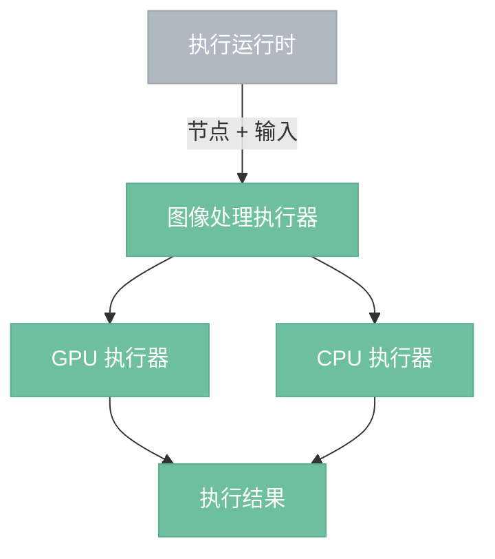
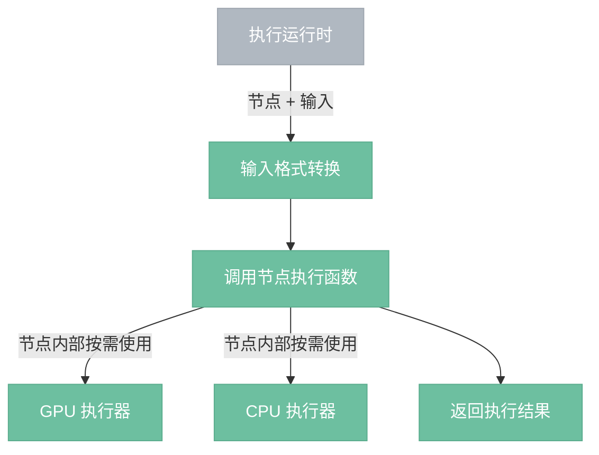

# 图像处理执行器

> 本地 GPU/CPU 执行像素运算和文件 I/O。

## 总览

GPU 执行器和 CPU 执行器是协作关系。GPU 负责给可并行的计算提速，CPU 处理 GPU 做不了的事。一个节点执行过程中可能只用其中一个，也可能两者都用。

**性能原则**：数据留在显存里最快（零搬运）。CPU 介入意味着显存 → 内存 → 显存的往返开销。因此能纯 GPU 完成的节点尽量纯 GPU，只有文件 I/O、复杂算法等 GPU 做不了的事才让 CPU 介入。

---

## 执行流程

---

## 组件

- **GPU 执行器**：通过 WGSL compute shader 加速像素级并行运算。内含 wgpu device/queue 和 Pipeline 缓存。统一模式：获取输入 GpuImage → 创建空输出纹理 → 获取/缓存 Pipeline → 构建 bind group → 提交 GPU 计算 → 返回 GpuImage。所有 shader 使用 16x16 workgroup size。
- **CPU 执行器**：处理 GPU 无法完成的操作——文件 I/O（load_image、save_image）、数据分析（histogram）、文件解析（LUT）、复杂数学算法（bicubic/lanczos3 插值）。
- **格式转换**：GPU 执行器收到 CPU Image 时自动上传为 GpuImage；CPU 执行器收到 GpuImage 时自动回读为 Image。转换对节点实现透明。

## 边界情况

- **GPU 不可用**：无 GPU 或初始化失败时，需要 GPU 加速的节点若有 CPU 实现则走 CPU，否则报错。
- **Pipeline 缓存**：同名 shader 只编译一次，后续调用直接复用。
