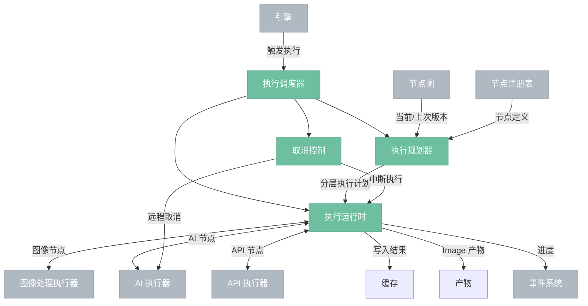
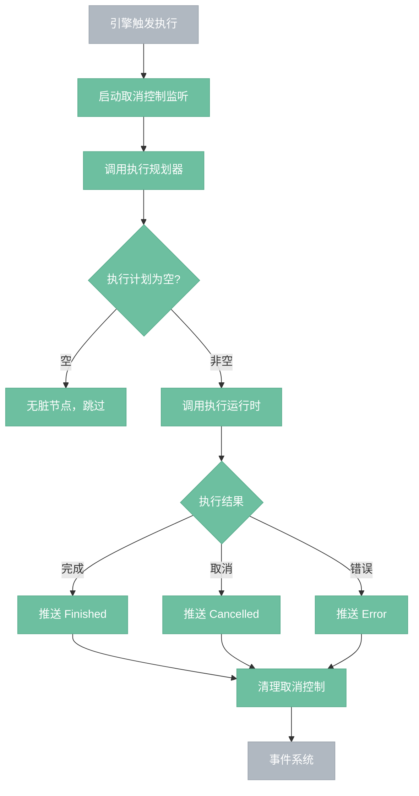
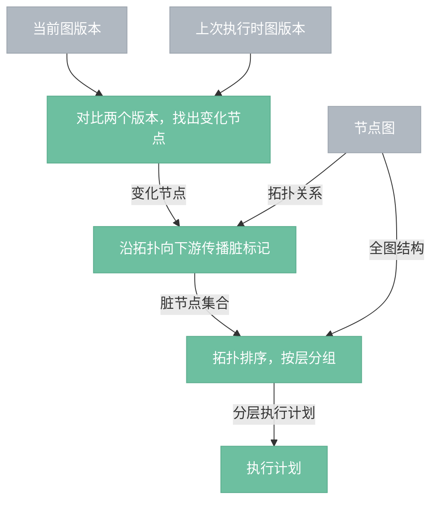
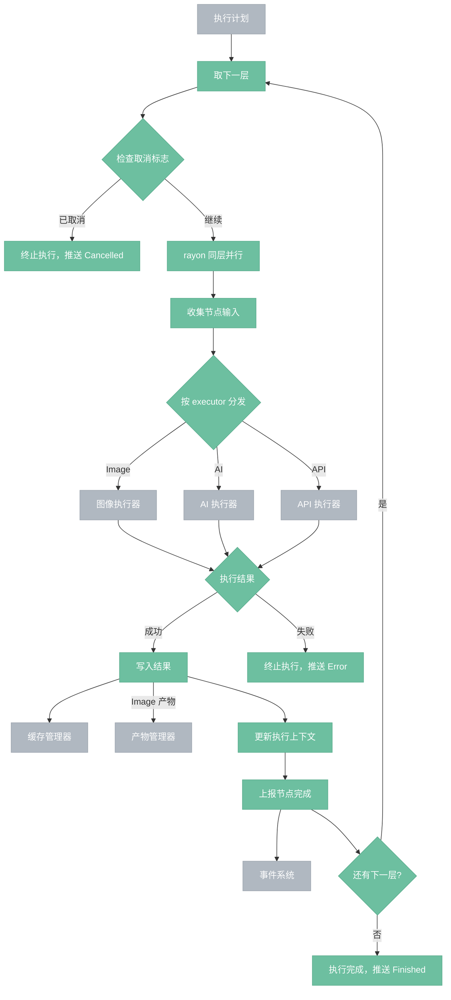
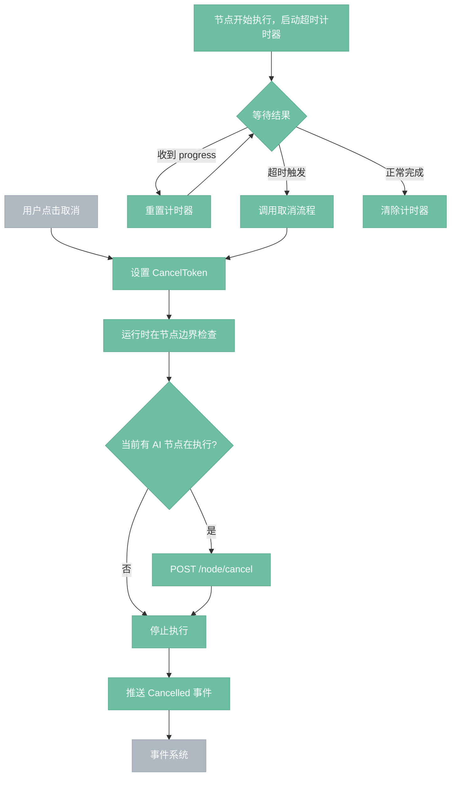

# 执行调度器

> 拓扑排序，维护脏标记，逐节点分发执行。

## 总览

---

## 执行调度器流程

---

## 执行规划器

---

## 执行运行时

---

## 取消控制

---

## 组件

- **执行规划器**：对比当前图版本和上次执行时的图版本，找出变化节点，沿拓扑向下游传播脏标记，按层分组输出执行计划。
- **执行运行时**：按执行计划逐层执行，同层节点 rayon 并行。维护执行上下文（中间结果暂存，供下游节点读取输入）。结果写入缓存管理器，AI/API 的 Image 产物额外写入产物管理器。
- **取消控制**：CancelToken（AtomicBool）+ 按节点类型差异化的超时计时器。运行时在节点边界检查标志；AI 节点在 Python 执行时额外发送 POST /node/cancel 远程中断。收到 progress 事件重置超时计时器。

## 边界情况

- **首次执行**：无"上次版本"，所有节点视为脏，全图执行。
- **强制重新执行**（抽卡）：引擎 API 支持 force_execute(node_id)，将指定节点及其下游强制标脏。
- **执行中修改图**：节点图控制器基于不可变状态，调度器持有执行开始时的版本快照，用户修改产生新版本不影响当前执行。
- **断开的子图**：拓扑排序覆盖全图，脏标记只传播到受影响的子图，未变化的子图零开销跳过。

## 设计决策

- **D06**：独立后台线程 + rayon 并行，不引入 async/await。图求值是 CPU/GPU 密集型，线程池模型天然匹配。
- **D07**：AI/API 节点使用 reqwest::blocking 阻塞等待，保持同步执行模型。同层无依赖的 AI 节点通过 rayon 并发发起请求。
- **D23**：前端不阻塞。channel 通信 + ExecuteProgress 事件 + AtomicBool 取消标志。
