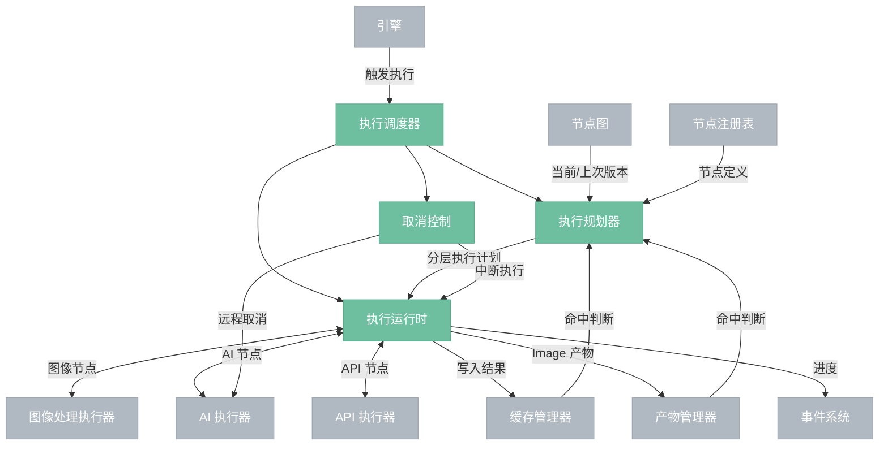

# 执行调度器

> 拓扑排序，维护脏标记，逐节点分发执行。

## 总览

```mermaid
%%{ init: { 'flowchart': { 'curve': 'basis' } } }%%
flowchart TB
    classDef internal fill:#6DBFA0,stroke:#5BAD8E,color:#fff
    classDef external fill:#B0B8C1,stroke:#9EA6AF,color:#fff

    引擎["引擎"]:::external -->|"触发执行"| 调度器["执行调度器"]:::internal

    调度器 --> 规划器["执行规划器"]:::internal
    调度器 --> 运行时["执行运行时"]:::internal
    调度器 --> 取消["取消控制"]:::internal

    节点图["节点图"]:::external -->|"当前/上次版本"| 规划器
    缓存["缓存管理器"]:::external -->|"命中判断"| 规划器
    产物["产物管理器"]:::external -->|"命中判断"| 规划器
    注册表["节点注册表"]:::external -->|"节点定义"| 规划器

    规划器 -->|"分层执行计划"| 运行时

    运行时 <-->|"图像节点"| 图像执行器["图像处理执行器"]:::external
    运行时 <-->|"AI 节点"| AI执行器["AI 执行器"]:::external
    运行时 <-->|"API 节点"| API执行器["API 执行器"]:::external

    运行时 -->|"写入结果"| 缓存
    运行时 -->|"Image 产物"| 产物
    运行时 -->|"进度"| 事件系统["事件系统"]:::external

    取消 -->|"中断执行"| 运行时
    取消 -->|"远程取消"| AI执行器
```
