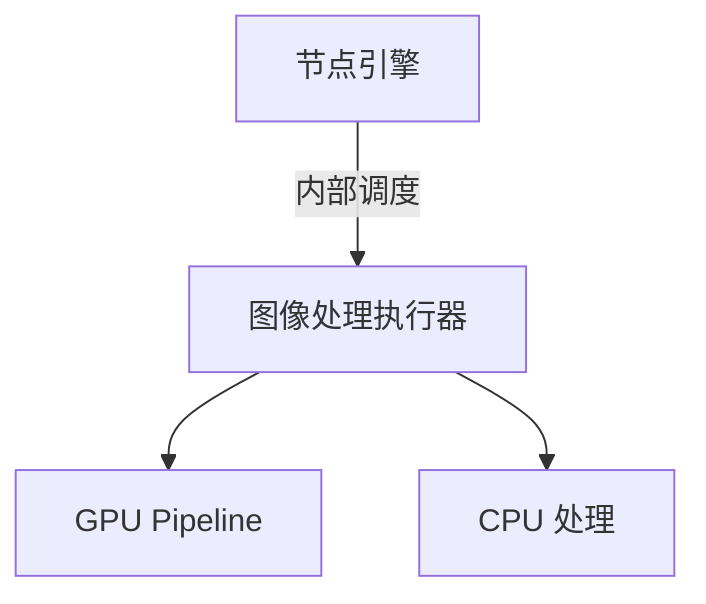

# 图像处理执行器

> 本地 GPU/CPU 执行像素运算和文件 I/O。

## 总览

```mermaid
flowchart TB
    Engine["节点引擎"]

    Engine -->|"内部调度"| ImageExec["图像处理执行器"]
    ImageExec --> GPU["GPU Pipeline"]
    ImageExec --> CPU["CPU 处理"]
```
