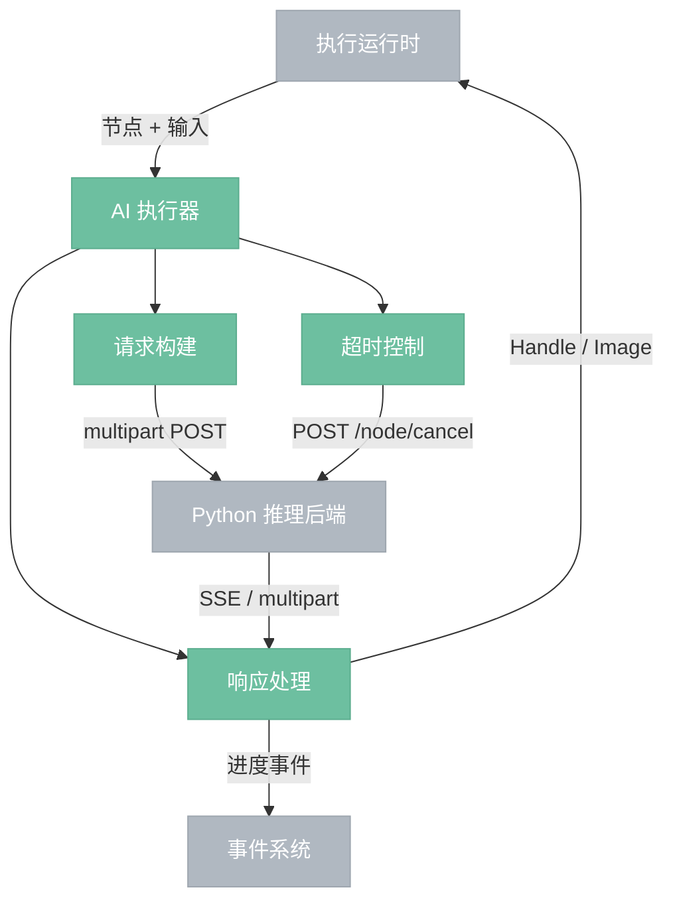
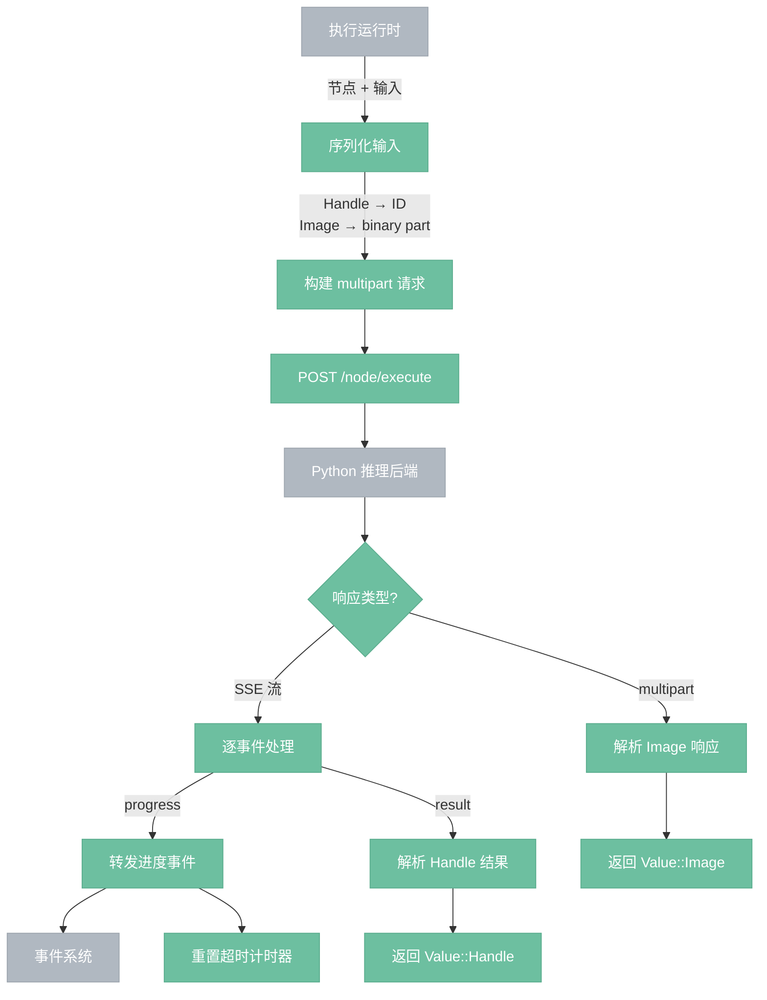

# AI 执行器

> 调用 Python 推理后端执行 AI 节点。

## 总览

---

## 执行流程

---

## 操作

| 操作 | 说明 |
|------|------|
| 请求构建 | 将节点输入序列化为 multipart 请求：Handle 转为 ID 字符串，Image 作为 binary part |
| 响应处理 | 按响应类型处理——SSE 流（Handle 输出 + 进度）或 multipart（Image 输出） |
| 超时控制 | 按节点类型设定超时，收到 progress 重置计时器，超时触发 POST /node/cancel |

---

## 组件

- **请求构建**：将节点输入序列化为 `/node/execute` 的 multipart 请求。Handle 类型输入转为 `{"handle": "id"}` 的 JSON 引用，Image 类型输入作为独立 binary part 传输。
- **响应处理**：根据响应类型分别处理。SSE 流用于 Handle 输出节点——逐事件读取 progress（转发给事件系统）和 result（解析为 Value::Handle）。multipart 用于 Image 输出节点——直接解析图像字节为 Value::Image。
- **超时控制**：按节点类型差异化超时（LoadCheckpoint 120s、KSampler 600s 等）。收到 progress 事件重置计时器。超时触发时调用 `POST /node/cancel/{execution_id}` 中断 Python 端执行。

## 边界情况

- **Handle 失效**：Python 返回 handle_error 时，失效对应缓存条目，重新执行上游节点。
- **VRAM 不足**：Python 返回 CUDA OOM 时，Rust 根据 vram_info 选择释放目标，调用 `/handles/release` 后重试。
- **Python 崩溃**：连接失败时不重试当前节点，等待引擎层的 Python 进程恢复机制。
- **取消**：用户取消执行时，AI 执行器发送 `/node/cancel`，Python 在迭代节点的步间检查取消标志。非迭代节点不可中断，取消请求可能在执行完成后才到达。
