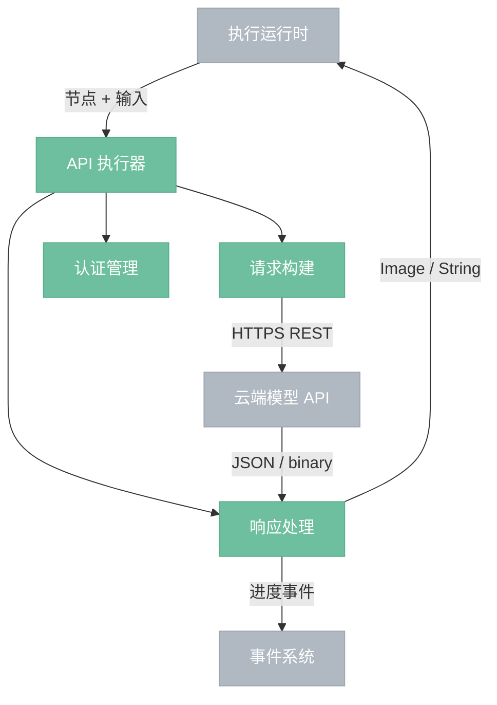
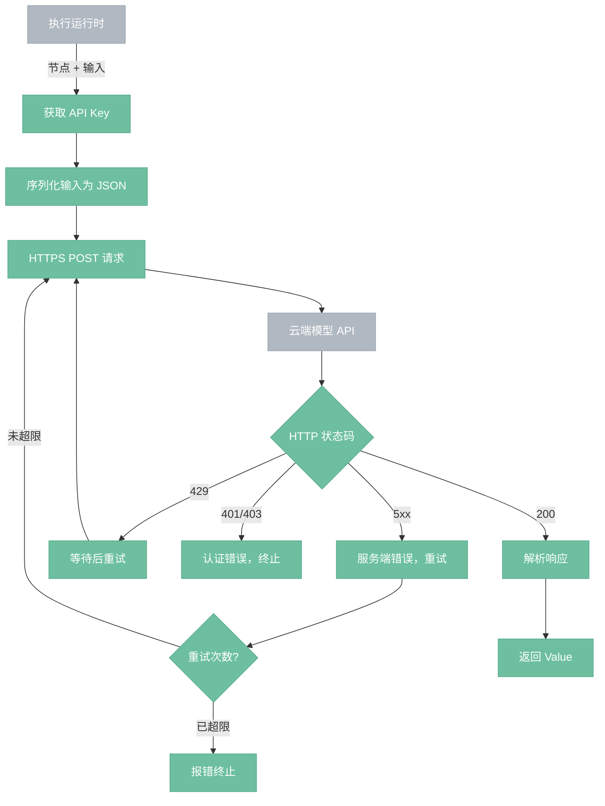

# API 执行器

> 调用云端模型 API 执行推理，无状态 HTTPS 调用。

## 总览

---

## 执行流程

---

## 操作

| 操作 | 说明 |
|------|------|
| 请求构建 | 将节点输入序列化为云端 API 要求的 JSON 格式，附加 API Key |
| 响应处理 | 解析 JSON / binary 响应，Image 结果解码为 Value::Image |
| 认证管理 | 从配置读取 API Key，按 provider 匹配（OpenAI、Stability AI 等） |
| 重试控制 | 429 速率限制等待后重试，5xx 服务端错误有限次重试，4xx 客户端错误直接终止 |

---

## 组件

- **请求构建**：按云端 API 的接口规范序列化请求。不同 provider 格式不同（OpenAI 和 Stability AI 的接口各异），由节点定义指定 provider 和 endpoint。Image 输入编码为 base64 嵌入 JSON。
- **响应处理**：解析云端返回的 JSON / binary 数据。Image 结果解码为 Value::Image，文本结果解码为 Value::String。
- **认证管理**：从项目配置或环境变量读取 API Key，按 provider 名称匹配。Key 缺失时节点报错不可用。
- **重试控制**：429（速率限制）读取 Retry-After 头等待后重试。5xx（服务端错误）指数退避重试，最多 3 次。401/403（认证错误）和其他 4xx 直接终止。

## 边界情况

- **API Key 缺失**：节点报错，不发送请求。
- **网络超时**：reqwest 连接/读取超时后报错，不自动重试（区别于 5xx 重试）。
- **响应格式异常**：解析失败时报错，附带原始响应内容便于调试。
- **计费风险**：每次调用都有成本，重试次数有上限，不会无限重试。
