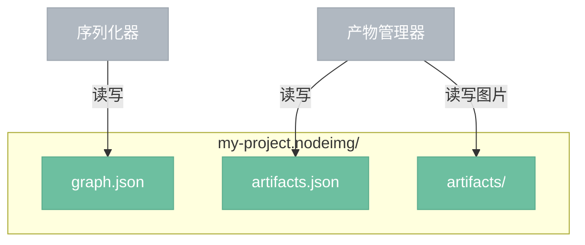

# 项目文件

> .nodeimg bundle 格式定义，包含节点图、产物索引和产物图片。

## 总览



## 目录结构

```
my-project.nodeimg/
  graph.json            — 节点图（节点、连接、参数）
  artifacts.json        — 产物索引（元数据、当前选用）
  artifacts/            — 产物图片
    {node_id}/
      001.png
      002.png
      ...
```

## 文件说明

- **graph.json**：节点图数据，包含节点定义、连接关系、参数值、画布坐标。由序列化器读写。
- **artifacts.json**：产物索引，记录每个 AI/API 节点的产物历史（版本号、时间戳、种子、参数快照、文件路径）和当前选用版本。由产物管理器读写。
- **artifacts/**：产物图片文件，按节点 ID 分目录存放。由产物管理器读写。

## 设计要点

- `.nodeimg` 是一个目录（macOS bundle 风格），Finder/资源管理器中显示为单个文件。
- graph.json 和 artifacts.json 分离：节点图轻量、频繁保存；产物索引随生成过程增量更新。
- 产物图片不嵌入 JSON，独立存放在 artifacts/ 目录，避免项目文件膨胀。
