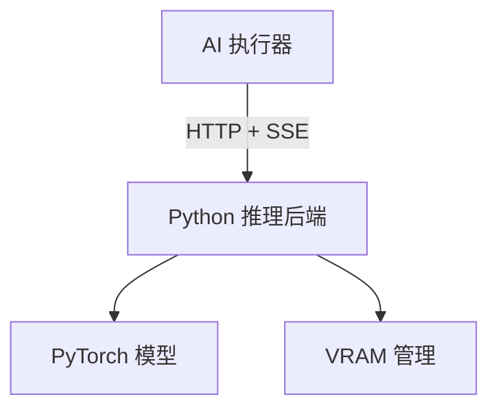

# Python 推理后端

> 独立进程，FastAPI + PyTorch，执行模型推理。

## 总览

```mermaid
flowchart TB
    AIExec["AI 执行器"]

    AIExec -->|"HTTP + SSE"| Python["Python 推理后端"]
    Python --> Models["PyTorch 模型"]
    Python --> VRAM["VRAM 管理"]
```
