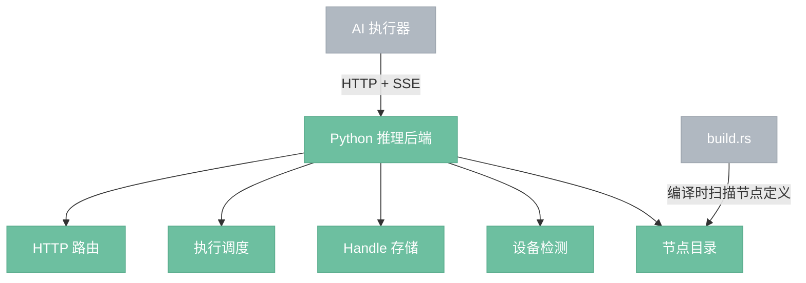
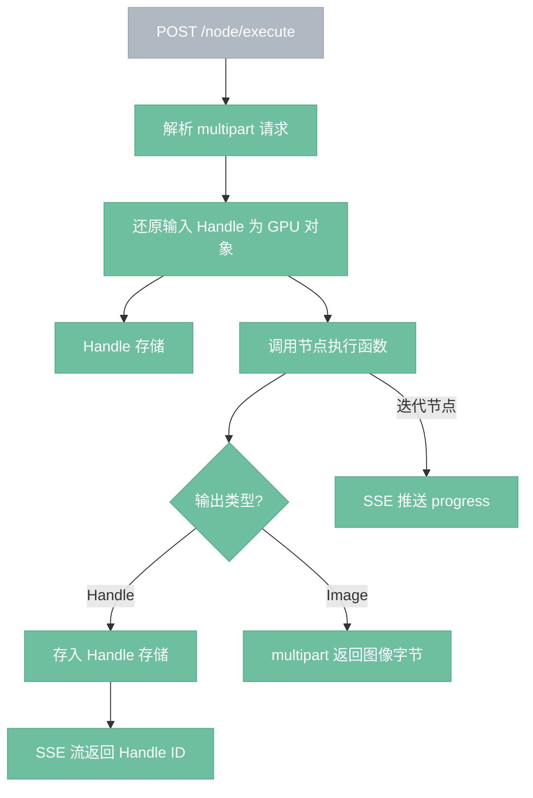
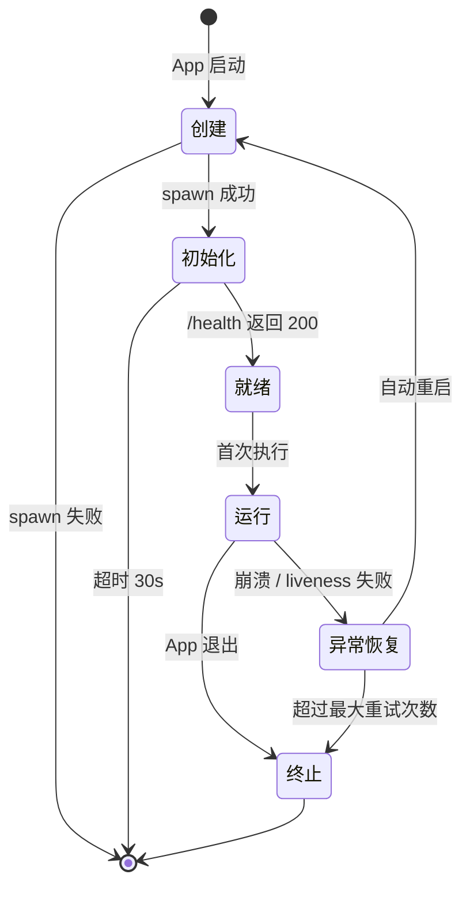

# Python 推理后端

> 独立进程，FastAPI + PyTorch，执行模型推理，同时是 AI 节点的定义源。

## 总览

---

## HTTP 接口

| 接口 | 方法 | 用途 | 响应类型 |
|------|------|------|----------|
| /health | GET | 设备状态、VRAM、Handle 统计 | JSON |
| /node/execute | POST | 执行单个 AI 节点 | SSE（Handle 输出）或 multipart（Image 输出） |
| /node/cancel/{execution_id} | POST | 取消正在执行的节点 | JSON |
| /handles/release | POST | 批量释放 Handle | JSON |

---

## 执行流程

---

## 组件

- **HTTP 路由**（server.py）：FastAPI 应用，只做路由和序列化，不含业务逻辑。
- **执行调度**（executor.py）：维护执行队列，根据 GPU 负载决定并行或排队。轻量节点可并行，重型节点（KSampler）独占 GPU。管理取消标志位，迭代节点每步检查。
- **Handle 存储**（handle_store.py）：`dict[str, Any]`，handle_id 到 GPU 对象的映射。提供存入、还原、释放、列举操作。释放时 `del` + `gc.collect()` + `torch.cuda.empty_cache()`。
- **设备检测**（device.py）：CUDA / MPS / CPU 检测，float16 / float32 选择，VRAM 查询。
- **节点目录**（nodes/）：每个文件一个 AI 节点，@node 装饰器定义元信息，函数体为执行逻辑。Rust 编译时扫描此目录生成 NodeDef。

---

## Handle 机制

Handle 是 Python GPU 对象（Model、Conditioning、Latent 等）的不透明引用，Rust 侧只持有字符串 ID。

**ID 格式**：`{node_type}_{output_pin}_{自增计数器}`，如 `load_checkpoint_model_0001`。

**生命周期**：
- 节点执行产出 GPU 对象 → 存入 Handle 存储 → 返回 ID 给 Rust
- Rust 缓存失效 → 调用 /handles/release → Python 释放 GPU 对象
- Handle 条目在 Rust 侧豁免 LRU 淘汰（重新加载代价高）
- Python 崩溃 → VRAM 随进程回收 → Rust 清除本地 Handle 缓存

---

## 进程生命周期

| 状态 | 说明 |
|------|------|
| 创建 | Rust spawn Python 子进程 |
| 初始化 | 轮询 /health（500ms 间隔，30s 超时） |
| 就绪 | /health 返回 200，校验协议版本 |
| 运行 | 处理请求，定期 liveness 检查（30s 间隔） |
| 异常恢复 | 清除 Rust 侧 Handle 缓存，自动重启（最多 3 次） |
| 终止 | SIGTERM → 等待 5s → SIGKILL |

Python 后端是可选依赖。启动失败时 AI 节点不可用，图像处理节点正常工作。

---

## VRAM 管理

Python 端遇到 VRAM 不足时返回错误和 Handle 列表。决策权在 Rust 端：

1. Rust 读取 Handle 列表和 VRAM 占用
2. 选择释放目标（最久未被下游引用的 Handle）
3. 调用 /handles/release 释放
4. 重试执行

Python 只报告现状，不自行淘汰，保证两端状态一致。

---

## 边界情况

- **Python 未安装**：spawn 失败，AI 节点灰显不可用，其他功能正常。
- **协议版本不匹配**：主版本号不同则 AI 节点不可用，次版本号不同仅日志警告。
- **并发请求**：同层无依赖的 AI 节点并发发送请求，Python 内部队列调度。
- **模型按需加载**：就绪状态不加载模型，由 LoadCheckpoint 节点触发首次加载。
